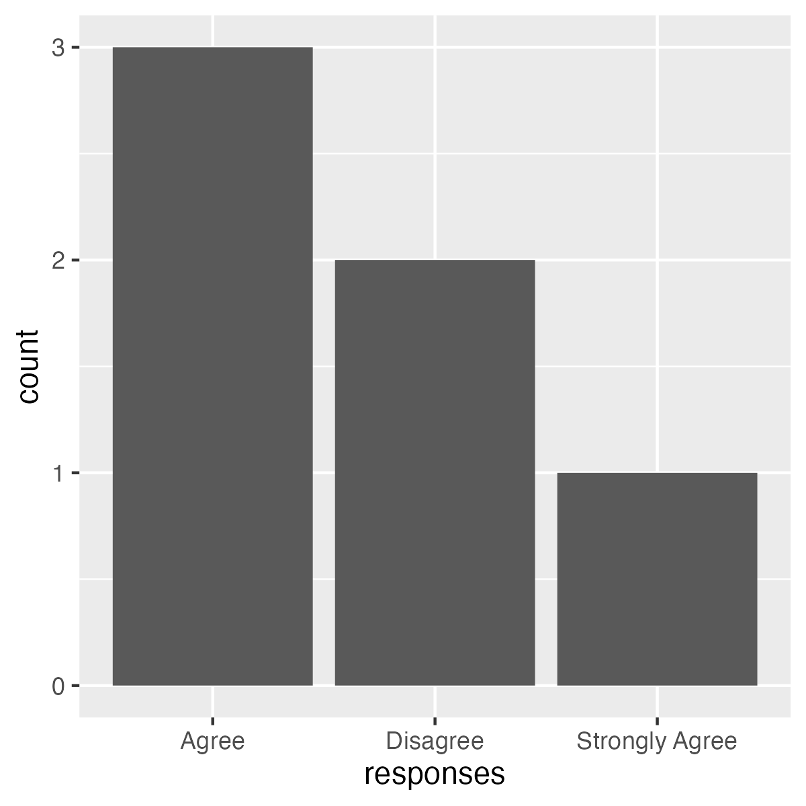
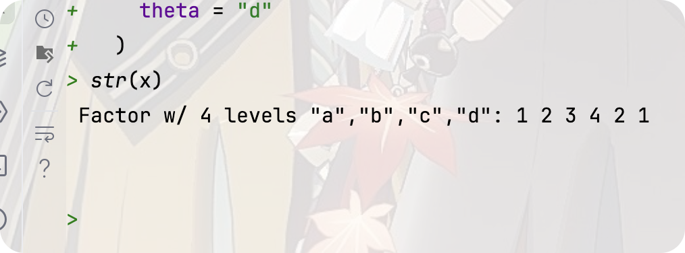
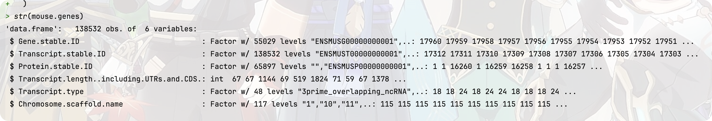

# Review of the course “R for Data Science” Part 01(Talk 01~ 04)

<font size = 1>**By Haoran Nie @ HUST Life ST**</font>

<font size = 1>**Partically translated by [Rui Zhu @ HUST Life ST](https://github.com/1508324011)**</font>

<font size = 1>**双语版**</font>

> Reference: [R for Data Science](https://r4ds.had.co.nz)
>
> The book updated to 2^nd^ ed. on July,2023, here’ s a [link](https://r4ds.hadley.nz) to the official website.

<p xmlns:cc="http://creativecommons.org/ns#" >This work is licensed under <a href="http://creativecommons.org/licenses/by-nc-sa/4.0/?ref=chooser-v1" target="_blank" rel="license noopener noreferrer" style="display:inline-block;">CC BY-NC-SA 4.0</a></p>

# Multi-omics data analysis and visualisation, #1

> Talk 01
>
> View the original slide through [this link](https://github.com/Lucas04-nhr/R-for-Data-Science/blob/main/talk01.pdf).
>
> View the original R markdown file of the slide through [this link](https://github.com/Lucas04-nhr/R-for-Data-Science/blob/main/talk01.Rmd).

This section has ~~nothing~~ something to explain :)

## Install R

Go go ~~<https://mirrors.tuna.tsinghua.edu.cn/CRAN/>~~~~(清华镜像)~~[华科镜像](https://mirrors.hust.edu.cn/CRAN)(https://mirrors.hust.edu.cn/CRAN)，R支持主流的操作系统包括Linux，Windows和MacOS，请根据操作系统下载对应的安装文件。

新版本的Mac OS还需要安装XQuartz(<http://xquartz.macosforge.org/landing/>)。某些还需要用到Xcode，可以从AppStore免费安装或者使用`xcode --select install`命令从控制台安装“XCode命令行工具”（体积更小更实用）。

目前大多Linux发行版都带有R，因此可直接使用。从CRAN下载文件进行安装稍嫌复杂，要求用户对Linux系统有一定的了解，而且需要有管理员权限。建议初级用户在Linux高手指导下安装。点击"Download R forLinux"后，发行版为Redhat（红帽）或Suse的用户要先阅读网站上提供的readme或readme.html文件，然后其中的指示进行安装。这里就不再累述了。

## R studio

RStudio可以从 https://posit.co/downloads/ 下载，支持等主流的操作系统。

# R language basics, part 1

> Talk 02
>
> View the original slide through [this link](https://github.com/Lucas04-nhr/R-for-Data-Science/blob/main/talk02.pdf).
>
> View the original R markdown file of the slide through [this link](https://github.com/Lucas04-nhr/R-for-Data-Science/blob/main/talk02.Rmd).

##  基础数据类型

最基本的数据类型包括**数字**、**逻辑符号**和**字符串**，是其他数据类型的基本构建块。

### 数字 
```{r}
## 整数
287

## 小数
99.99

## 科学计数法
1e-3
1e2
```
### 逻辑符号
```{r eval=FALSE}
TRUE
T

FALSE
F

##其本质是数字
1 + TRUE
2 * FALSE
```
### 字符串
```{r eval=FALSE}
'a sentence' ## 单括号
"一个字符串" ## 双括号
'1.123'      ## 像是数字的字符串
'*%%*()!@##&@(9'  ## 乱码
```


##  简单数据类型

这包括向量和矩阵，它们都可以包含某种基本数据类型的多个值，如**矩阵(matrix)**由多个数字组成，**vector**由多个字符串组成，等等。但是，**它们只能包含一种数据类型。**

```R
c(100, 20, 30) ## Interger vector 
c("String", "Array", "It's me".) ## String vector
c(TRUE, FALSE, TRUE, T, F) ## A logic vector
```

如上所示，数组通常用函数``c（）``（又叫做 **concatenation function**）来定义。此外，包含连续整数**向量**可以使用``：``运算符来定义。
```{r}
2:8
```
##  数据类型之间的转换

1. 自动转换

  一个``vector``只能包含一种基本数据类型。因此，在定义数组时，如果输入值是混合的，某些基本数据类型会自动转换为其他类型，以确保数字类型的一致性；这在英语中被称为**coerce**，具有强制转换的含义。此转换的优先级为：

  * Logical types -> numeric types

  * Logical Type -> String 

  * numeric type -> string

  * 逻辑类型 -> 数字类型

   * 逻辑类型 -> 字符串

   * 数字类型 -> 字符串

     

  vector 的数据类型转换规则

  ```{r}
  class( c(45, TRUE, 20, FALSE, -100) ); ## 逻辑和数字类型
  str( c("string a", FALSE, "string b", TRUE) ); ## 逻辑和字符
  str( c("a string", 1.2, "another string", 1e-3) ); ## 数字和字符
  ```

1. 手动切换

	除了自动转换之外，还可以手动转换向量中元素的类型:

	我们可以用 `class()`或`str() ` 函数来判断 vector包含的数据类型
	
	```{r}
	class(matrix( c(20, 30.1, 2, 45.8, 23, 14), 
	              nrow = 2, byrow = T ));
	```
	
	```
	[1] "matrix" "array" 
	```
	
	```{r}
	str(matrix( c(20, 30.1, 2, 45.8, 23, 14), 
	            nrow = 2, byrow = T ));
	```
	
	```
	 num [1:2, 1:3] 20 45.8 30.1 23 2 14
	```
	
	
	
	+ Checking the type of a variable `class()`
	+ Checking of classes `is.type()`
	+ Conversion of classes `as.type()`

## 一些特殊值

+ `NA` (Not Available) missing values

+ `NaN` (Not a Number)is meaningless

+ `-Inf` Negative Infinity

+ `Inf` Positive Infinity

+ `NULL` Null

Some functions to determine these special values:

+ `is.na()`
+ `is.finite()`
+ `is.infinite()`

## Vectors and Matrix

都是数组。 A `vector` is a one-dimensional array and a matrix is a two-dimensional array.

This means.

- There can be more dimensional arrays

- 高维数组， like `vector` and matrices, **只能包含一种基本数据类型。**

- Higher dimensional arrays can be defined by the `array()` function.

  

### 矩阵由函数 `matrix()` 定义，比如：

```{r}
matrix( c(20, 30.1, 2, 45.8, 23, 14), nrow = 2, byrow = T );
```

矩阵的指定长度，即 nrow  ×  ncol，可以不同于输入数据的长度。矩阵长度较小时，输入数据会被截短；而矩阵长度较大时，输入数据则会被重复使用。

```{r}
## 生成一个2x5长度为10的矩阵，但输入数据的长度为20
matrix( 1:20, nrow = 2, ncol = 5, byrow = T); 

## 生成一个2x3长度为6的矩阵，但输入数据长度只有3
matrix( 1:3, nrow = 2, ncol = 3, byrow = T ); 
```

下面两种情况，系统会报警告信息。
第一种情况，矩阵长度大于输入数据长度，且前者不是后者的整数倍。

```{r}
matrix( 1:3, nrow = 2, ncol = 4, byrow = T );
```

第二种情况，矩阵长度小于输入数据的长度，且后者不是前者的整数倍。

```{r}
matrix( letters[1:20], nrow = 3, ncol = 5, byrow = T );
```

## **加减乘除逻辑运算**老一套

```{r eval=FALSE}
1 + 2 - 3 * 4 / 5; ## 加减乘除
1 + (2 - 3) * 4 / 5;  ##  改变优先级
2 ^ 6; ## 阶乘
5 %% 2; ## 取余
T | F; ## or 
T & F; ## and
5 | 0; ## == 0 FALSE， ！= 0 TRUE，任何非零值视为逻辑真
```

## 通过 Console window 管理变量

```{r}
ls();  ## 显示当前环境下所有变量
rm( x ); ## 删除一个变量
ls(); 

##rm(list=ls()); ## 删除当前环境下所有变量！！！ 
```

## vector 算术 **vectorisation**：R最重要的一个概念

```{r}
x <- c(10,100,1000, 10000);
( y <- sqrt( x  ) * 4 + 10  ); ## 赋值的之后打印变量内容 
```

核心在于数据**自动循环使用**

```{r}
x / c(10,100);
[1]   1   1 100 100
x / c(10,100,1000); ## 会报错但仍会循环计算
Warning: 长的对象长度不是短的对象长度的整倍数[1]    1    1    1 1000
```

## matrix 算术

```{r}
m <- matrix( c(20, 30.1, 2, 45.8, 23, 14), nrow = 2, 
       dimnames = list( c("row_A", "row_B"), c("A", "B", "C") ) );
A	B	C
row_A	20.0	2.0	23
row_B	30.1	45.8	14

m / 10;
 A    B   C
row_A 2.00 0.20 2.3
row_B 3.01 4.58 1.4

m /  c(1,10,100);
A     B    C
row_A 20.00  0.02 2.30
row_B  3.01 45.80 0.14
```
### 更多  matrix 相关函数

```R
dim(m);
nrow(m);
ncol(m);
range(m); ## Available when the content is numeric
summary(m); ## Can also be used in vector
```

Extra:

- Incorporation 

- ```{r}
  a <- 1:3;
  b <- LETTERS[1:3];
  
  ( ab <- c(a,b) );
  mode( ab ); ## 一个新的函数~ ... 
  ```

- Take part `ab[1]`

- Replacement of individual values `ab[1] = c`

- Replacing multiple values `ab[c(2, 3)] = c("Weihua", "Chen")`

- Naming elements and replace values `names(ab) = as.character(ab)`

- Reverse `rev(1:10)`

- Sort&order 

	```R
	lts = sample(LETTERS[1:20])
	sort(lts)
	```

- 提取一行或多行

	```R
	# (There's already some data in workspace)
	
	$ m
	> (List the content of matrix "m")
	
	$ m[1, ]
	> (List the first row of matrix 'm')
	
	$ m[1:2, ]
	> (List the first two rows of matrix 'm')
	```

	> You can also let the console to fetch multiple lines as the order you give.
	>
	> ```R
	> m[c("row_B", "row_A")]
	> ```
	>
	> 控制台将以“row_B”和“row_A”的顺序输出矩阵“m”的内容。

- 获取一列或多列

	> As can be seen from the same principle, I only list codes here

	```R
	m[ , 1]
	m[ , c(1:2)]
	m[ , c("col_B", "col_A")]
	```

- Fetch parts `m[1:2, 2:3]`

- Replacement

	```R
	m[1, ] = c(10)
	m[, "C"] = c(230, 140)
	m[1:2,] = matrix( 1:6, nrow=2)
	m[1, c("C", "B")] = matrix(110:111, nrow = 1)
	```

- 转置 `t(m)`

## The hierarchy of R’s vector types


You can use function `typeof()` to know the type of a vector.

Here are some examples of other `is.xxx()` function:

```R
is.null( NULL )
is.numeric( NA )
is.numeric( Inf );
## 用于替代 typeof 的函数
is.list();
is.logical();
is.character();
is.vector();
# more ...
```


# R language basics, part 2

> Talk 03
>
> View the original slide through [this link](https://github.com/Lucas04-nhr/R-for-Data-Science/blob/main/talk03.pdf).
>
> View the original R markdown file of the slide through [this link](https://github.com/Lucas04-nhr/R-for-Data-Science/blob/main/talk03.Rmd).

## `data.frame`

### **What is a `data.frame`?**

-   二维表格
-   由不同列组成；每列是一个**vector**，不同列的数据类型可以不同，但一列只包括一种数据类型（int, num, chr ...）
-   各列的长度相同

```R
library(tidyverse);
library(kableExtra)
kbl(head(mpg), 
    booktabs = T)
```

Here’s the result:


### **Usage of `head()` and `tail()`**

```{r}
nrow(mpg); ## total number of rows 
kbl( head(mpg,  n=3), booktabs = T); ## 显示前几行数据
kbl( tail(mpg,  n=3), booktabs = T); ## 显示最后3行数据
```

- `head()` is a function to display the first rows of some data (vectors etc.)
- `tail()` is a function to display the last rows of some data (vectors etc.)

### Structure of `data.frame` & `tibble`

`str(mpg)`

This command shows the structure of the tibble `mpg`:


### Make a new `data.frame`

You can use the function `data.frame()` to make a new `data.frame`

```R
data2 =
	data.frame(
  	data = sample(1:100, 10),
    group = sample(LETTERS[1:3], 10, replace = TRUE)
    data2 = 0.1
  )
```

### How to add row(s)/col(s) to an existing data.frame

Create the "table header" first, then populate the `data.frame`

先创建"表头"，再填充

```R
df2 =
	data.frame( 
    x = character(), 
    y = integer(), 
    z = double() , 
    stringsAsFactors = FALSE 
  )

df2 =
	rbind( 
    df2, 
    data.frame(
      x = "a",
      y = 1L, 
      z = 2.2 
    ) 
  )

df2 =
	rbind( 
    df2, 
    data.frame( 
      x = "b", 
      y = 2, 
      z = 4.4 
    ) 
  )

df2
  x y   z
1 a 1 2.2
2 b 2 4.4

m <- cbind(1, 1:7) ; ## 产生两列数据 7行数据 .. 
( m <- cbind(m, 8:14) ); ## 增加一列 也有7行数据 ... 
     [,1] [,2] [,3]
[1,]    1    1    8
[2,]    1    2    9
[3,]    1    3   10
[4,]    1    4   11
[5,]    1    5   12
[6,]    1    6   13
[7,]    1    7   14
```

**ATTENTION**

- Use `rbind()` function to add rows, use `cbind()` function to add columns.

- Define the new line using `data.frame()` function, the "header" needs to be the same as the merged table.

You can also use these functions to bind several data.frames.

## `tibble`

`tibble` is kind of similar to `data.frame`.

**注**：Tibble class 是 data.frame 的升级版本；

### Make new `tibble`

`tibble`相关功能由`tibble`或`tidiverse`包提供

Almost all of the functions that you’ll use in this book produce tibbles, as tibbles are one of the unifying features of the tidyverse. Most other R packages use regular data frames, so you might want to coerce a data frame to a tibble. You can do that with `as_tibble()`:

```R
as_tibble(iris)
#> # A tibble: 150 × 5
#>   Sepal.Length Sepal.Width Petal.Length Petal.Width Species
#>          <dbl>       <dbl>        <dbl>       <dbl> <fct>  
#> 1          5.1         3.5          1.4         0.2 setosa 
#> 2          4.9         3            1.4         0.2 setosa 
#> 3          4.7         3.2          1.3         0.2 setosa 
#> 4          4.6         3.1          1.5         0.2 setosa 
#> 5          5           3.6          1.4         0.2 setosa 
#> 6          5.4         3.9          1.7         0.4 setosa 
#> # ℹ 144 more rows
```

Another way to create a tibble is with `tribble()`, short for **tr**ansposed tibble. `tribble()` is customised for data entry in code: 列标题由公式定义（即以“~”开头），条目由逗号分隔。这使得以易于阅读的形式布置少量数据成为可能。

也可以用 tibble 函数创建

-   注意每列的数据类型
-   长度不足时，比如**data2**列，会循环使用
-   `sample()`函数的用法

```R
tribble(
  ~x, ~y, ~z,
  #--|--|----
  "a", 2, 3.6,
  "b", 1, 8.5
)
#> # A tibble: 2 × 3
#>   x         y     z
#>   <chr> <dbl> <dbl>
#> 1 a         2   3.6
#> 2 b         1   8.5

## 用 tibble 函数创建，用法和 data.frame() 相似
dat <- 
  tibble( data = sample( 1:100, 10 ), 
        group = sample( LETTERS[1:3], 10, replace = TRUE), 
        data2 = 0.1 )
# A tibble: 10 × 3
    data group data2
   <int> <chr> <dbl>
 1    86 A       0.1
 2    41 B       0.1
 3    72 B       0.1
 4    68 C       0.1
 5    10 A       0.1
 6    99 B       0.1
 7    66 B       0.1
 8    33 B       0.1
 9    81 A       0.1
10    42 C       0.1
```

- `add_row()`
- `add_column()`

```{r}
## 新tibble, with defined columns ... 创建表头 
tb <- tibble( x = character(), y = integer(), z = double() );
dim(tb);

## 增加行 ... 
tb <- add_row( tb, x = "a", y = 2, z = 3.6  );
tb <- add_row( tb, x = "b", y = 1, z = 8.5  );

## 显示 
tb;

## 生成一个 tibble 
df <- tibble(x = 1:3, y = 3:1);

# 在第二行之前插入
df <- add_row(df, x = 4, y = 0, .before = 2);

## 插入多行 
df <- add_row(df, x = 4:5, y = 0:-1);

## 插入另一个tibble （与另一个tibble合并） 
df2 <- tibble( x = as.double(200:202), y = as.double(1000:1002) );
df3 <- add_row( df, df2 ); ## 可以运行 ... 

tb3 <- tribble(
  ~x, ~y,  ~z,
  "a", 2,  3.6,
  "b", 1,  8.5
);

tb3 <- add_column( tb3, a = 98 ); ## recycle ... 
tb3 <- add_column( tb3, b = LETTERS[1:2], c = c("CHEN", "WANG") ); 
```

### tibble元素替换

```{r eval=FALSE}
## 取得行
tb3[c(1,2), ];

## 取得列，按顺序取列
tb3[, c("z", "y")];

## 替换列 
tb3[["z"]] <- c(4.6, 5.5);

## 替换行 
tb3[ 1, ] <- tibble( x = "d", y = 20, z = 46, a = 10, b = "C", c = "LILI" );
```

### Manipulate the tibble

> See “Manipulate the `data.frame`”

### `tibble` to `data.frame`

- `as.data.frame()`
- `as_tibble()`

**e.g.**

```R
library(tibble)
as.data.frame(head(as_tibble(iris)))
```

## Differences between tibble and data.frame

### Tibble 按顺序计算列

```R
rm(x,y) # Delete possible x, y
tibble(x = 1:5, y = xˆ2); # You can do this with tibble
data.frame(x = 1:5, y = x ˆ 2); # But data.frame doesn't work.
```

### `data.frame` causes trouble when fetching `subset` operations

取子集成vector

```R
df1 =
	data.frame(x = 1:3, y = 3:1)
class(df1[, 1:2])

#> [1] "data.frame"

# Subset operation :takes a column and expects a data.frame () 
class(df1[, 1]) # The result is a vector ...

#> [1] "integer"

## Tibble doesn't.
df2 =
	tibble(x = 1:3, y = 3:1)
class(df2[, 1]) ## 永远都是 tibble 

#> [1] "tbl_df" "tbl" "data.frame"
```

###  `tibble` allows controlled data type conversion

```{r}
class(df2[[1]]); ## 取一列，转换为 vector 
class(df2$x); ## 用 [[]] 或 $ 都可以哦

[1] "numeric"
[1] "numeric"
```

### Recycling

```R
data.frame(a = 1:6, b = LETTERS[1:2]); ##  data.frame 可以！！！
```

**OUTPUT**

```shell
#   a b 
# 1 1 A 
# 2 2 B 
# 3 3 A 
# 4 4 B 
# 5 5 A 
# 6 6 B
```

```R
tibble(a = 1:6, b = LETTERS[1:2]); ## 但 tibble 不行！！！
```

**OUTPUT**

```shell
# Error:
# ! Tibble columns must have compatible sizes. ## * Size 6: Existing data.
# * Size 2: Column `b`.
# ℹ Only values of size one are recycled.
```

<font color = red><font size = 5>**ATTENTION!**</font></font>

`tibble`的 recycling 仅限于长度为1或等长；而 `data.frame` 则为整除即可。

### `data.frame` will do partial matching, while `tibble` will <font color = red><font size = 5>**NEVER**</font></font> do it.

```R
df = data.frame(abc = 1) 
df$ab; # Unwanted result ...

df2 = tibble(abc = 1)
df2$a; # Produce a warning and return NULL
```

**OUTPUT**

```shell
#[1] 1
#Warning: Unknown or uninitialised column: `a`. NULL
```

## Advanced tips for using `data.frame` and `tibble`

- `attach()`
- `detach()`
- `with()`
- `within()`

> Following is the introduction (Produced by ChatGPT)

这些函数——``attach（）``、``detach（）``、``with（）``和``within（）``——在处理R中的数据帧或tibble时非常有用，有助于更流畅的工作流和代码可读性。下面是它们的功能分解：

### `attach()` and `detach()`

- **Purpose**: 这些函数允许您将data.frame临时附加到搜索路径上，使其列可以通过名称直接访问。
- **Usage**:
  - `attach(df)` attaches the specified data frame `df`.
  - `detach(df)` detaches the specified data frame `df`.
- **Example**:
  
  ```R
  data(mtcars) # Loading a sample dataset
  attach(mtcars) # Attaching mtcars
  
  # Now, columns can be accessed directly
  summary(mpg)
  mean(mpg)
  
  detach(mtcars) # Detaching mtcars
  ```
- **Note**: 虽然使用``attach（）``很方便，但有时会导致混乱或意外的后果，例如屏蔽环境中的变量。由于潜在的副作用，通常建议避免使用``attach（）``。

### `with()`

- **Purpose**: `with()` 允许您在不使用`$`的情况下引用数据框架的列的环境中执行表达式。
- **Usage**:
  
  - `with(data, expr)` evaluates `expr` in the context of the specified data frame `data`.
- **Example**:
  ```R
  data(mtcars) # Loading a sample dataset
  
  with(mtcars, {
    mean(mpg)
    summary(cyl)
    })
  ```
- **Advantage**:它有助于避免在处理其列时重复使用数据框架名称。

### `within()`

- **Purpose**: Similar to `with()`, `within()` allows modification of a data frame by计算其中的表达式。
- **Usage**:
  
  - `within(data, expr)` modifies `data` according to `expr` and returns the modified data frame.
- **Example**:
  ```R
  data(mtcars) # Loading a sample dataset
  
  modified_mtcars <- within(mtcars, {
    mpg_square <- mpg^2
    hp_doubled <- hp * 2
    })
  head(modified_mtcars) # Checking the modified data frame
  ```
- **Advantage**: `within()` 非常有用，当你想创建或修改数据框架内的列时不必重复引用数据框架名称。

Remember, while these functions can streamline your code, it's crucial to use them judiciously to avoid unexpected behavior or cluttering your global environment.

Here's the console print output for the examples provided earlier:

```R
# Using attach() and detach()
data(mtcars) # Loading a sample dataset
attach(mtcars) # Attaching mtcars

# Now, columns can be accessed directly
summary(mpg)
# Output:
#    Min. 1st Qu.  Median    Mean 3rd Qu.    Max. 
#  10.40   15.43   19.20   20.09   22.80   33.90 

mean(mpg)
# Output:
# [1] 20.09062

detach(mtcars) # Detaching mtcars

# Using with()
data(mtcars) # Loading a sample dataset

with(mtcars, {
  mean(mpg)
  # Output:
  # [1] 20.09062
  
  summary(cyl)
  # Output:
  #   Min. 1st Qu.  Median    Mean 3rd Qu.    Max. 
  #   4.00   4.00    6.00    6.188   8.00    8.00 
})

# Using within()
data(mtcars) # Loading a sample dataset

modified_mtcars <- within(mtcars, {
  mpg_square <- mpg^2
  hp_doubled <- hp * 2
})
head(modified_mtcars) # Checking the modified data frame
# Output:
#                    mpg cyl disp  hp drat    wt  qsec vs am gear carb mpg_square hp_doubled
# Mazda RX4         21.0   6  160 110 3.90 2.620 16.46  0  1    4    4     441.00       220
# Mazda RX4 Wag     21.0   6  160 110 3.90 2.875 17.02  0  1    4    4     441.00       220
# Datsun 710        22.8   4  108  93 3.85 2.320 18.61  1  1    4    1     519.84       186
# Hornet 4 Drive    21.4   6  258 110 3.08 3.215 19.44  1  0    3    1     457.96       220
# Hornet Sportabout 18.7   8  360 175 3.15 3.440 17.02  0  0    3    2     349.69       350
# Valiant           18.1   6  225 105 2.76 3.460 20.22  1  0    3    1     327.61       210
```

## File IO

### Read from files

Using functions from the `readr` package

```R
# readr is part of tidyverse 
library(tidyverse) # or alternatively 
library(readr)
```

Some available functions:

- `read_csv()`: comma separated (CSV) files
- `read_tsv()`: tab separated files
- `read_delim()`: general delimited files
- `read_fwf()`: fixed width files
- `read_table()`: tabular files where columns are separated by white-space. read_log(): web log files

> Full documentation of the package is available through this [link](https://www.rdocumentation.org/packages/readr/versions/1.3.1).

#### Usage

+ Read with predifined column types

	```R
	myiris2 =
		read_csv("../data/talk03/iris.csv", 
	           col_types = 
	           	cols( 
	              Sepal.Length = col_double(),
	              Sepal.Width = col_double(),
	              Petal.Length = col_double(),
	              Petal.Width = col_double(),
	              Species = col_character() 
	            )
	          )
	```

- To read from other formats, you can try the following packages:

	> Similar to Python

	- `haven` - SPSS, Stata, and SAS files 

	- `readxl` - excel files (.xls and .xlsx) DBI - databases

	- `jsonlite` - json

	- `xml2` - XML

	- `httr` - Web APIs

	- `rvest` - HTML (Web Scraping)

### Write to files

Use the following functions to write object(s) to external files:

> Default parameters are listed.
>
> More related documents can be found in this [link](https://r4ds.had.co.nz/data-import.html?q=file#writing-to-a-file).

- Comma delimited file: 逗号分隔文件

	```R
	write_csv(
	  x, 
	  path, 
	  na = “NA”, 
	  append = FALSE, 
	  col_names = !append
	) 
	```

- File with arbitrary delimiter: 带有任意分隔符的文件

	```R
	write_delim(
	  x, 
	  path, 
	  delim = ” “, 
	  na =”NA”, 
	  append = FALSE, 
	  col_names = !append
	)
	```

- CSV for excel: 

	```R
	write_excel_csv(
	  x, 
	  path, 
	  na = “NA”, 
	  append = FALSE,
	  col_names = !append
	) 
	```

- String to file: 

	```R
	write_file(
	  x,
	  path, 
	  append = FALSE
	)
	```

- String vector to file, one element per line: 

	```R
	write_lines(
	  x,
	  path,
	  na = “NA”, 
	  append = FALSE
	) 
	```

- Object to RDS file: 

	```R
	write_rds(
	  x,
	  path, 
	  compress = 
	  	c(
	      “none”,
	      “gz”,
	      “bz2”,
	      “xz”
	    ),
	  ...
	)
	```

- Tab delimited files: 

	```R
	write_tsv(
	  x, 
	  path, 
	  na = “NA”, 
	  append = FALSE, 
	  col_names = !append
	)
	```

# R language basics, part 3: factor

> Talk 04
>
> View the original slide through [this link](https://github.com/Lucas04-nhr/R-for-Data-Science/blob/main/talk04.pdf).
>
> View the original R markdown file of the slide through [this link](https://github.com/Lucas04-nhr/R-for-Data-Science/blob/main/talk04.Rmd).

## IO and working enviroment management

Each R session is a separate **work space** containing its own data, variables, and operation history.


Each RStudio session is automatically associated with a R session

> Not only RStudio, PyCharm or VSCode also support R session.
>
> However, I’m keen on coding with PyCharm but not RStudio, for its wonderful Plug-in Environment, which can let me use plug-ins such as Code GeeX by Zhipu AI (a company founded by some student in KEG team inTsinghua University) or GitHub Copilot by GitHub to let the coding process more quickly, for the instruction from GPTs.
>
> tips: Rstudio最新版也支持  Github Copliot, 可以在 options 内设置


If you want to coding with R using PyCharm or other JetBrains IDE (i.e. IntelliJ, CLion, etc.), remember to install the *R Language Plug-in*


For instruction how to get FREE Student Lisence of GitHub Pro, GitHub Copilot and JetBrains Products and their benefits, see their official website:

- [GitHub Global Campus](https://campus.github.com)

	Make sure you don’t use VPNs and use your phone to log in and apply (HUST Campus Network is recommended), give “Precise Location” permission to your browser. You may use your “[Student Number]@hust.edu.cn” mail to verify your identity as a student studying in HUST.

- [JetBrains Products](https://www.jetbrains.com/lp/leaflets-gdc/students/)

	Because our email addresses ending with “@hust.edu.cn” are banned due to misuse, you should apply for an online verification report on [CHSI](chsi.com.cn) (press the link to visit the website), instructions [here](https://www.chsi.com.cn/xlcx/rhsq.jsp).

### Start a new RStudio session by creating a new project

> To start a new session in PyCharm, simply press the bottom corner and select a new session.

- Click the Project button in the upper right corner and select New Project in the pop-up menu …

	

- Select: New directory -> New Project in the popup window

	

- Enter a new directory name, choose its mother directory ...

	

### Working Space

当前工作空间，包括所有已装入的数据、包和自制函数

可通过以下代码管理变量

```R
ls();  ## 显示当前环境下所有变量
rm( x ); ## 删除一个变量
ls(); 

##rm(list=ls()); ## 删除当前环境下所有变量！！！ 
```

### Variables in working space in RStudio

The "Environment" window in the upper right corner of RStudio shows all the variables of the current workspace.


### Save and restore work space

```R
# Save all loaded variables into an external .RData file
save.image(file = "prj_r_for_bioinformatics_aug3_2019.RData") 
# Restore (load) saved work space
load(file = "prj_r_for_bioinformatics_aug3_2019.RData")
```

**Notes:**

- Existing variables will be kept, however, those will the same names will be replaced by loaded variables

- Please consider using `rm(list=ls())` to remove all existing variables to have a clean start

- You may need to reload all the packages

### Save selected variables

Sometimes you need to transfer processed data to a collaborator ...

```R
# Save selected variables to external
save(
  city, 
  country, 
  file="1.RData"
)
# You can specify directory name
load("1.RData")
```

### Close and (re)open a project

- To close a project

	

- In RStudio and similar IDEs, there are some preferences to choose

	

> The UI in PyCharm


**Notes:**

- Save on exit
- Load on opening 
- When the data is large, the loading time may be too long ...

### Open a project


> When in PyCharm, simply drag the working directory to its main window, remember to trust the project.
>

## Factors

Factor是一种用于字段的数据结构，它只接受预定义的、有限数量的值（分类数据）。它将限制输入数据的选取。

```{r}
## create factor from scratch ... 
x <- factor( c( "single", "married", "married", "single" ) );

## create factor as it is ... 
x <- c("single", "married", "married", "single");
x <- as.factor(x);

## please note the change in the displayed values ... 
str(x);
#Factor w/ 2 levels "married","single": 2 1 1 2

#限制输入数据的选择范围
x[ length(x) + 1 ] <- "widowed";
#Warning: 因子层次有错，产生了NA
```

### Play around with `levels()`

```{r}
##利用levels解决
levels(x) <- c(levels(x), "widowed");
x[ length(x) + 1 ] <- "widowed";
str(x);

## other ways of assigning factors ... 
y <-  as.factor( c( "single", "married", "married", "single" ) );
levels( y );
levels(y) <- c("single", "married", "widowed");
str(y);
## 这个代码现在就没有问题了
y[ length(y) + 1 ] <- "widowed";
```

**注意** 用 `as.factor` 创建 factor 时，得到的 levels 按字母表排列；

但是，用 `levels( y )` 方式指定 levels 时，则按照指定的顺序；

#### `levels`的顺序决定了排序的顺序

```{r}
##
y <-  as.factor( c( "single", "married", "married", "single" ) );
levels(y);
sort(y);
#[1] "married" "single" 
#[1] married married single  single Levels: married single

## 
y2 <- y;
levels(y2) <- c("single", "married", "widowed");
sort(y2);
#[1] single  single  married married Levels: single married widowed
```

sort data in a meaningful way ... 

```{r}
## Month
x1 <- c("Dec", "Apr", "Jan", "Mar");
sort(x1);

month_levels <- c(
  "Jan", "Feb", "Mar", "Apr", "May", "Jun", 
  "Jul", "Aug", "Sep", "Oct", "Nov", "Dec"
)

y1 <- factor(x1, levels = month_levels)
sort(y1);
#[1] "Apr" "Dec" "Jan" "Mar"
#[1] Jan Mar Apr Dec
#12 Levels: Jan Feb Mar Apr May Jun Jul Aug Sep Oct ... Dec

## Sometimes you’d prefer that the order of the levels match the order of the first appearance in the data.
f1 <- factor(x1, levels = unique(x1));
f1;
#[1] Dec Apr Jan Mar Levels: Dec Apr Jan Mar

library(forcats); ## just to make sure the codes will run smoothly ... 
## you can also use fct_inorder in the forcats package ...
f2 <- x1 %>% factor() %>% fct_inorder()
f2
#[1] Dec Apr Jan Mar Levels: Dec Apr Jan Mar
```

Here are instructions of modifying factor levels

> Based on the textbook

The levels 既简洁又不一致。让我们调整使之更长，并使用一个平行的结构。Like most rename and recoding functions in the tidyverse,新的值在左边，旧的值在右边：

``fct_recode``Change factor levels by hand

```R
load(gss_cat)

mutate(
  partyid = fct_recode(partyid,
    "Republican, strong"    = "Strong republican",
    "Republican, weak"      = "Not str republican",
    "Independent, near rep" = "Ind,near rep",
    "Independent, near dem" = "Ind,near dem",
    "Democrat, weak"        = "Not str democrat",
    "Democrat, strong"      = "Strong democrat"
  )
) 

count(partyid)

#> # A tibble: 10 × 2
#>   partyid                   n
#>   <fct>                 <int>
#> 1 No answer               154
#> 2 Don't know                1
#> 3 Other party             393
#> 4 Republican, strong     2314
#> 5 Republican, weak       3032
#> 6 Independent, near rep  1791
#> # ℹ 4 more rows
```

使用这种技术时要小心：如果你把完全不同的类别组合在一起，你最终会得到误导性的结果。

The order of the `levels` determines the sorting order.

### Use factor to clean data

> Usage of `fct_xxx()` functions.

Suppose I have a set of gender data that is written in a very irregular way:

```R
## 假设我有一组性别数据，其写法非常不规整；
gender <- c("f", "m ", "male ","male", "female", "FEMALE", "Male", "f", "m");

gender_fct =
  as.factor(gender)

fct_count(gender_fct)
```

The output looks like this:


Now I request to replace with Female, Male.

```R
## 要求：都改为 Female, Male
gender_fct =
  fct_collapse(
    gender,
    Female = c("f", "female", "FEMALE"),
    Male = c("m ", "m", "male ", "male", "Male")
  )

fct_count(gender_fct)
```


You can also use `fct_relabel()` to do the same thing

```R
fct_relabel(
  gender,
  ~ ifelse(
    tolower(
      substring(., 1, 1)) == "f",
    "Female",
    "Male"
  )
)
```

### factor 在做图中的应用（**真正精髓**）

```R
## 一项 mock 调查结果数据
library(ggplot2)

responses =
  factor(
    c("Agree", "Agree", "Strongly Agree", "Disagree", "Disagree", "Agree")
  )

response_barplot =
  ggplot(
    data = data.frame(responses),
    aes(x = responses)
  ) +
  geom_bar()
```



默认情况下， factor 按字母表排序： Agree -> Disagree -> Strong Agree 。ggplot2 也会按factor的排序作图

 `ggplot2` also plots `factor` in that order, so you can adjust the `factor` to adjust the drawing order.

```R
res =
  data.frame(responses)
# Sort by level of agreement from strong -> weak
res$res =
  factor(
    res$res,
    levels =
       c("Strongly Agree", "Agree", "Disagree"),
    ordered = T
  )

response_barplot2 =
  ggplot(
    data = res,
    aes(x = res)
  ) +
  geom_bar() +
  xlab("Response")+ ylab("Count")
```


You can also use the parameter `ordered` to let others know that your `factor` is ordered properly.

```R
responses =
  factor(
    c("Agree", "Agree", "Strongly Agree", "Disagree", "Disagree", "Agree"),
    ordered = TRUE
  )
is.ordered( responses )
```


### Using `factor` to vhange values

You can use `recode()` in `dplyr` package to change `value`

`dplyr` 是一种数据操作的语法，提供了一组一致的动词 that help you solve the most common data manipulation challenges:

+ `mutate()` adds new variables that are functions of existing variables
+ `select()` picks variables based on their names.
+ `filter()` picks cases based on their values.
+ `summarise()` reduces multiple values down to a single summary.
+ `arrange()` changes the ordering of the rows.

These all combine naturally with `group_by()` which allows you to perform any operation “by group”. You can learn more about them in `vignette("dplyr")`. As well as these single-table verbs, dplyr also provides a variety of two-table verbs, which you can learn about in `vignette("two-table")`.

> Based on the introduction on the [official website](https://dplyr.tidyverse.org) of `dplyr`.

Here’s an example:

使用 ```dplyr``` 包的 ```recode()```函数改变 value 

```R
x =
  factor(
    c("alpha", "beta", "gamma", "theta", "beta", "alpha")
  )

x =
  recode(
    x,
    alpha = "a",
    beta = "b",
    gamma = "c",
    theta = "d"
  )
```



### Delete useless `levels`

```R
mouse.genes =
  read.delim(
    file = "data/talk04/mouse_genes_biomart_sep2018.txt",
    sep = "\t",
    header = T, 
    stringsAsFactors = T 
  )
```



If you draw a plot without deleting the useless `levels`, you will get this result:


```subset()``` 无法去除不用的 factors ... 

```{r fig.width=10, fig.height=4}
mouse.chr_10_12 <- subset( mouse.genes,  Chromosome.scaffold.name %in% c( "10", "11", "12" ) );
## plot length distribution --

boxplot( Transcript.length..including.UTRs.and.CDS. ~ Chromosome.scaffold.name, 
         data = mouse.chr_10_12, las = 2 );
```

But when you delete the useless `level` using these commands:

```R
mouse.chr_10_12$Chromosome.scaffold.name =
  droplevels(mouse.chr_10_12$Chromosome.scaffold.name)
levels( mouse.chr_10_12$Chromosome.scaffold.name )
```

You will see that:


Then, you’ll get the plot like this:


*Source code:*

``` R
mouse_gene_plot02 =
  ggplot(
    mouse.chr_10_12,
    aes(
      x = Chromosome.scaffold.name,
      y = Transcript.length..including.UTRs.and.CDS.
    )
  ) +
  geom_boxplot() +
  labs(
    x = "Chromosome Scaffold Name",
    y = "Transcript Length (including UTRs and CDS)"
  )
```

You can also use `tibble` to solve these problems:完全不用担心 factor 的问题 ... 

```R
mouse.tibble =
  read_delim(
    file = "data/talk04/mouse_genes_biomart_sep2018.txt",
    delim = "\t",
    quote = "",
    show_col_types = FALSE
  )

mouse.tibble.chr10_12 =
  mouse.tibble %>% filter(
    `Chromosome/scaffold name` %in% c("10", "11", "12"))


mouse_gene_plot03 =
    ggplot(
        mouse.tibble.chr10_12,
        aes(
        x = Chromosome.scaffold.name,
        y = Transcript.length..including.UTRs.and.CDS.
        )
    ) +
    geom_boxplot() +
    labs(
        x = "Chromosome",
        y = "Transcript length (bp)"
    ) +
    coord_flip() +
    ylim(0, 2500) +
    theme_bw()
```


### Advance usage

- Use `reorder()` function to reorder the level.

- `reorder()` 函数在 R 语言中通常用于改变因子（factor）水平的顺序。这对于数据可视化非常有用，特别是当你使用 ggplot2 包绘图时。在 ggplot2 中，`reorder()` 可以帮助你重新安排条形图、箱形图等的顺序。

  函数的基本用法是 `reorder(x, ...)`，其中 `x` 是你想要重新排序的因子，而 `...` 是额外的参数和方法，用于确定新的排序。最常见的用法是根据另一个变量的某种统计度量（如平均值、中位数等）来排序。

  ```R
  x = reorder( 
    `Chromosome/scaffold name`,
    `Transcript length (including UTRs and CDS)`,
    median
  )
  ```

- Use `forcats::fct_reorder()` to reorder factors

	```R
	x = fct_reorder( 
	  `Chromosome/scaffold name`,
	  `Transcript length (including UTRs and CDS)`,
	  median 
	)
	```

# 一些勘误

## vector 和 factor 有什么区别？

1. **向量 (Vector)**：
   - **概念**：向量是 R 中最基本的数据类型之一，用于存储相同类型的数据元素（如数值、字符或逻辑值）的序列。
   - **类型**：向量可以是数值型（numeric），字符型（character），逻辑型（logical）等。
   - **用途**：向量用于存储和操作数据集中的实际值。例如，一个存储温度读数或城市名称的序列。
1. **因子 (Factor)**：
   - **概念**：因子是用于表示分类数据的数据类型。它类似于枚举类型，用于表示有限的、通常是预定义的值集合。
   - **水平**：因子的值被称为水平（levels），这些水平代表了分类变量的可能值。
   - **用途**：因子主要用于统计建模和图形表示中，用于处理分类数据。例如，在绘制条形图时，条形的类别就是由因子类型的变量确定的。

区别：

- **数据类型**：向量直接存储值，而因子存储的是分类水平。
- **用途**：向量用于表示一系列的值，而因子用于表示分类或分组。
- **统计分析**：在进行统计分析时，因子用于指定数据的分类属性。例如，在回归分析中，因子可以用于指定自变量的分类。

## data.frame 与 tibble 的区别

1. **data.frame**：
   - **历史**：`data.frame` 是 R 语言中最传统的数据集结构，自 R 诞生之初就存在。
   - **特性**：它是一个表格型数据结构，每列可以包含不同类型的数据（数值型、字符型等），但每列数据类型必须一致。
   - **行为**：在某些操作中，`data.frame` 可能会自动将字符串转换为因子（这取决于 `stringsAsFactors` 的默认设置）。
   - **使用**：`data.frame` 在所有标准的 R 函数和包中广泛支持。
1. **tibble**：
   - **历史**：`tibble` 是相对较新的数据集结构，由 `tidyverse` 生态系统引入，旨在解决 `data.frame` 的一些局限性。
   - **特性**：`tibble` 保持了 `data.frame` 的所有基本特性，但添加了一些用户友好的改进，如更好的默认打印方法（显示更多信息，但更易于阅读）。
   - **行为**：`tibble` 不会自动将字符串转换为因子，保留了数据的原始类型。
   - **兼容性**：虽然 `tibble` 设计用于 `tidyverse` 生态系统，但它也兼容大多数接受 `data.frame` 的 R 函数。

关键区别：

- **因子转换**：`tibble` 默认不会将字符串自动转换为因子，而 `data.frame` 可能会这样做。
- **打印和查看数据**：`tibble` 提供了更友好的数据打印和查看方式，更适合于大型数据集。
- **设计理念**：`tibble` 是为了更好地适应现代数据分析需求而设计的，尤其是在 `tidyverse` 生态系统中。
