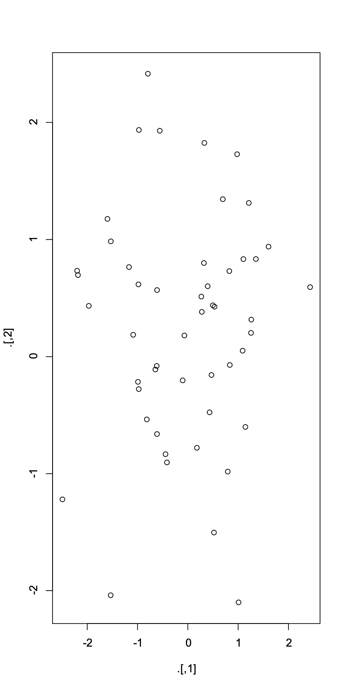
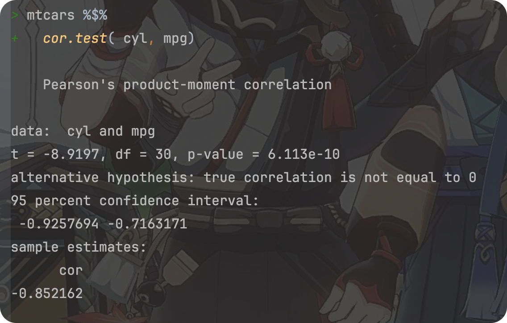

# Review of the course “R for Data Science” Part 02(Talk 05~ 08)

**<font size = 5>Click [here](./index.html) to return to the homepage.</font>**

**<font size = 5>Click [here](./REVIEW_01.html) to return to part 01.</font>**

---

<font size = 1>**By Haoran Nie @ HUST Life ST**</font>

> Reference: [R for Data Science](https://r4ds.had.co.nz)
>
> The book updated to 2^nd^ ed. on July,2023, here’ s a [link](https://r4ds.hadley.nz) to the official website.

<p xmlns:cc="http://creativecommons.org/ns#" >This work is licensed under <a href="http://creativecommons.org/licenses/by-nc-sa/4.0/?ref=chooser-v1" target="_blank" rel="license noopener noreferrer" style="display:inline-block;">CC BY-NC-SA 4.0</a></p>

---

To reduce the size, all the codes listed will ***NOT*** include the output as picture.

# R for bioinformatics, data wrangler, part 1

> Talk 05
>
> View the original slide through [this link](https://github.com/Lucas04-nhr/R-for-Data-Science/blob/main/talk05.pdf).
>
> View the original R markdown file of the slide through [this link](https://github.com/Lucas04-nhr/R-for-Data-Science/blob/main/talk05.Rmd).

## TOC

### pipe

### `dplyr`

### `tidyr`, part 1

## Pipe in R

### What is pipe in R?

-   pipe 就是 `%>%`.
-   It comes from the `magrittr` package by **Stefan Milton Bache**.
-   Packages in the `tidyverse` load `%\>%` for you automatically, so you don't usually load `magrittr` explicitly.
-   The essence is the passing of intermediate values.

**Example**

```R
library(tidyverse)
library(magrittr)
a =
 subset(swiss, Fertility > 20)
cor.test(a$Fertility, a$Education)
```

The code above can be replaced by:

```R
swiss %>%
  subset(., Fertility > 20) %$%
  cor.test(Education, Fertility)
```

You should remember that almost **all** the funtions support pipe.

### Other kinds of pipe

- `%T>%`: Return left-side values

	

- `%$>%`: Attach …

	

- `%<>%`

#### <font color = red>**ATTENTION**</font>

1. The use of pipe makes the idea clearer;
1. Therefore, try to use `%>%` (which has a clear direction) instead of the other pipe, which has an unclear direction.

---

## Data Wrangler - `dplyr`

### What is `dplyr`?

-   The next iteration of `plyr`,
-   Focusing on only data frames (also tibble),
-   Row-based manipulation,
-   `dplyr` is faster and has a more consistent API.

`dplyr` provides a consistent set of verbs that help you **solve the most common data manipulation challenges**:

-   [`select()`](https://dplyr.tidyverse.org/reference/select.html) Select columns, based on column name rules.
-   [`filter()`](https://dplyr.tidyverse.org/reference/filter.html) Filter rows by rule.
-   [`mutate()`](https://dplyr.tidyverse.org/reference/mutate.html) Add new column, calculated from other columns (no change in number of rows).
-   [`summarise()`](https://dplyr.tidyverse.org/reference/summarise.html) Converts multiple values to a single value (via mean, median, sd, etc.), generating new columns (total number of rows is reduced, usually in conjunction with `group_by`).
-   [`arrange()`](https://dplyr.tidyverse.org/reference/arrange.html) Sorting the rows.

```R
# Read the file
library(tidyverse)
mouse.tibble =
  read_delim(
    file = "data/mouse_genes_biomart_sep2018.txt",
    delim = "\t",
    quote = "",
    show_col_types = FALSE
  )

# View mouse.tibble content
ttype.stats =
  mouse.tibble %>%
    count(`Transcript type`) %>%
    arrange(-n)

# View mouse.tibble content, cont.
chr.stats =
  mouse.tibble %>%
    count(`Chromosome/scaffold name`) %>%
    arrange(-n)
```

---

# R for bioinformatics, data wrangler, part 2

> Talk 06
>
> View the original slide through [this link](https://github.com/Lucas04-nhr/R-for-Data-Science/blob/main/talk06.pdf).
>
> View the original R markdown file of the slide through [this link](https://github.com/Lucas04-nhr/R-for-Data-Science/blob/main/talk06.Rmd).

## TOC

### `tidyr`

-   `pivot_longer()`  to take the place of `gather`
-   `pivot_wider()`  to take the place of `spread`

## Data Wrangler - `tidyr`

You can get `tidyr` in the package set `tidyverse`, or simply install it the first time you want to use it via `install.packages("tidyr")`.

### The usage of `tidyr`

- Interconversion of wide and long data

	```R
	# Eg 1
	library(tidyverse)
	grades2 =
		read_tsv(file = "data/grades2.txt")
	
	grades3 =
		grades2 %>% 
		pivot_longer( 
	    - name,
	    names_to = "course",
	    values_to = "grade"
	  )
	```

	```R
	# Eg 2
	grades3_wide = grades3_long %>% 
	  pivot_wider(
	    names_from = "course",
	    values_from = "grade"
	  )
	```

	

### What’s the difference between wide and long data?

Here are pros and cons of wide data:

- Pros:
	- Natural and easy to understand;
- Cons：
	-    Not easy to handle;
	-    More problematic when sparse.

### If you meet `NA` in the 1st example, you can do like this:

```R
grades3_1 =
	grades3[!is.na(grades3$grade), ]
grades3_2 =
	grades3[complete.cases(grades3), ]

# A better solution
grades3_long = grades2 %>% 
  pivot_longer( - name, 
                names_to = "course", 
                values_to = "grade",
                values_drop_na = TRUE)

# Pay attention to the variant named "values_drop_na"
```

### More functions in `tidyr`: (See @ https://r4ds.hadley.nz/data-tidy.html)

- `tidyr::separate()`

	**Usage:**

	```R
	separate(
	  data,
	  col,
	  into,
	  sep = "[^[:alnum:]]+",
	  remove = TRUE,
	  convert = FALSE,
	  extra = "warn",
	  fill = "warn",
	  ...
	)
	
	# Default parameters are listed.
	```

- `tidyr::unite()`

	**Usage:**

	```R
	unite(
	  data,
	  col, 
	  ..., 
	  sep = "_", 
	  remove = TRUE, 
	  na.rm = FALSE
	)
	
	# Default parameters are listed.
	```

	---

# R for bioinformatics, Strings and regular expression

> Talk 07
>
> View the original slide through [this link](https://github.com/Lucas04-nhr/R-for-Data-Science/blob/main/talk07.pdf).
>
> View the original R markdown file of the slide through [this link](https://github.com/Lucas04-nhr/R-for-Data-Science/blob/main/talk07.Rmd).

## TOC


---

**<font size = 5>Click [here](./REVIEW_03.html) to go to part 03.</font>**