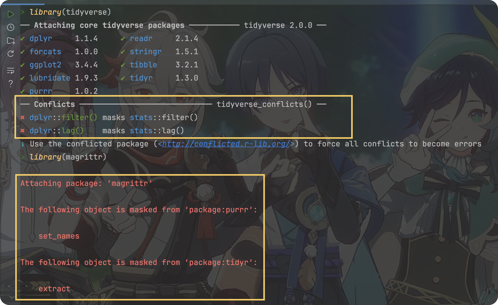
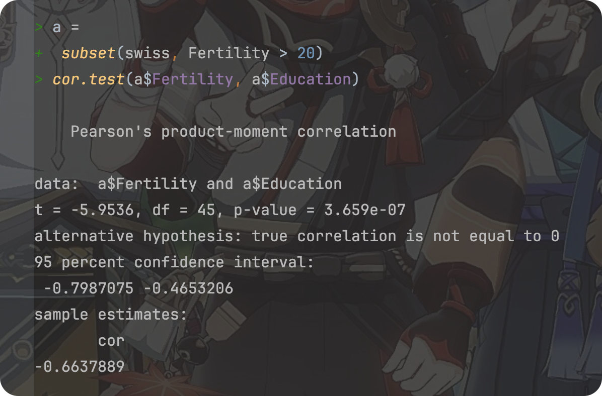
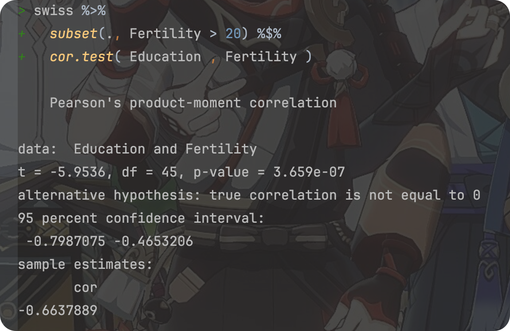
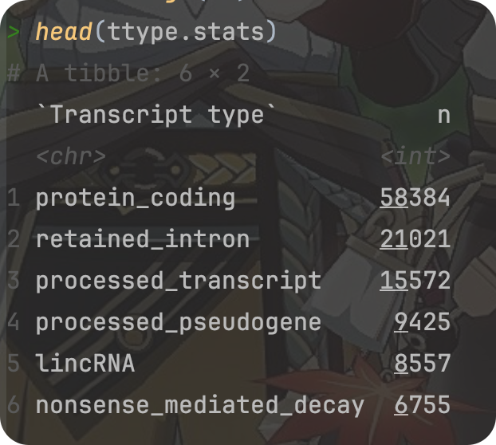
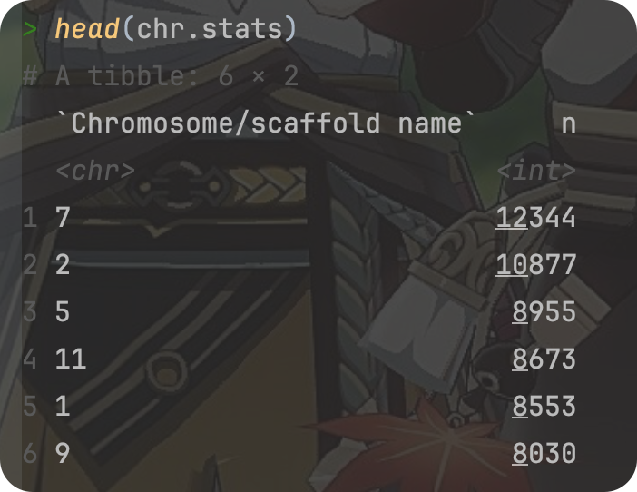

# Review of the course “R for Data Science” Part 02(Talk 05~ 08)

**<font size = 5>Click [here](./index.html) to return to the homepage.</font>**

**<font size = 5>Click [here](./REVIEW_01.html) to return to part 01.</font>**

---

<font size = 1>**By Haoran Nie @ HUST Life ST**</font>

<font size = 1>**Partically translated by [Rui Zhu @ HUST Life ST](https://github.com/1508324011)**</font>

<font size = 1>**双语版**</font>

> Reference: [R for Data Science](https://r4ds.had.co.nz)
>
> The book updated to 2^nd^ ed. on July,2023, here’ s a [link](https://r4ds.hadley.nz) to the official website.

<p xmlns:cc="http://creativecommons.org/ns#" >This work is licensed under <a href="http://creativecommons.org/licenses/by-nc-sa/4.0/?ref=chooser-v1" target="_blank" rel="license noopener noreferrer" style="display:inline-block;">CC BY-NC-SA 4.0</a></p>

---

# R for bioinformatics, data wrangler, part 1

> Talk 05
>
> View the original slide through [this link](https://github.com/Lucas04-nhr/R-for-Data-Science/blob/main/talk05.pdf).
>
> View the original R markdown file of the slide through [this link](https://github.com/Lucas04-nhr/R-for-Data-Science/blob/main/talk05.Rmd).

## Pipe in R

### What is pipe in R?

-   pipe 就是 `%>%`.
-   It comes from the `magrittr` package by **Stefan Milton Bache**.
-   Packages in the `tidyverse` load `%\>%` for you automatically, so you don't usually load `magrittr` explicitly.
-    实质是中间值的传递

**Example**

```R
library(tidyverse)
library(magrittr)
a =
 subset(swiss, Fertility > 20)
cor.test(a$Fertility, a$Education)
```





The code above can be replaced by:

```R
swiss %>%
  subset(., Fertility > 20) %$%
  cor.test(Education, Fertility)
```



所有函数都支持 pipe,通常需要用 `.` 指代传递来的数据，并以参数的形式赋予下游函数

- **`%>%`**：最常见的管道操作符，用于将左侧表达式的结果作为右侧表达式的第一个参数。在这种情况下，右侧表达式的结果会成为整个管道表达式的结果。
- **`%T>%` **：将左侧表达式的结果传递给右侧表达式。然而，与 `%>%` 不同的是，整个管道表达式的结果是左侧表达式的结果，而不是右侧表达式的结果。
- **`%$%` **:允许你在管道的右侧直接访问左侧对象的内部元素，而无需重复指定左侧对象的名称。特别适合用于那些需要从同一个数据对象中提取多个元素进行操作的情况，这在处理复杂的表达式时特别有用，可以使代码更加简洁和清晰。
- **`%<>%` **:结合了 `%>%` 和赋值操作的功能，允许你在对一个对象进行操作的同时更新这个对象本身。这意味着你可以在管道中对一个对象进行一系列的操作，并且这些操作的结果会直接反映到原始对象上，而不需要进行额外的赋值步骤。特别适用于数据处理和清理的场景，其中你需要对一个数据对象进行一系列的操作，并希望操作的结果直接更新到这个对象上。这样可以使得代码更加整洁，并减少潜在的错误，因为你不需要记住为每个中间步骤创建一个新的变量。

### egs:

- `%T>%`: 返回上游值 (left-side values),操作符在那些需要执行某些操作但不改变原始数据的场景中非常有用。例如，你可能想要打印或绘制原始数据的某些特性，同时保持数据本身不变以便后续操作。

```R
res1 <- 
  rnorm(100) %>%
    matrix(ncol = 2) %>%
    plot()#此步骤将整个流程的结果赋值给 res1。但 plot() 函数不会返回数据，所以 res1 将不包含任何数据。

res2 <- 
  rnorm(100) %>%
    matrix(ncol = 2) %T>%
    plot();#由于使用 %T>%，res2 将包含步骤 2 中生成的矩阵，而不是 plot() 的输出

```

- `%$>%`: Attach …

```R
attach( mtcars ); ## note the warning message ... 
cor.test( cyl, mpg ); ## 汽缸数与燃油效率

detach( mtcars );
with( mtcars, cor.test( cyl, mpg ) );

mtcars %$% 
cor.test( cyl, mpg );
```


- `%<>%`

```{r}
## 双向 pipe 
mtcars %<>% transform(cyl = cyl * 2);
```

#### <font color = red>**ATTENTION**</font>

1. pipe 的使用可以使思路更清晰
-   因此，尽量使用 `%>%` （方向明确），而不使用其它方向不明确的 pipe

---

## Data Wrangler - `dplyr`

### What is `dplyr`?

-   The next iteration of `plyr`,
-   Focusing on only data frames (also tibble),
-   Row-based manipulation,
-   `dplyr` is faster and has a more consistent API.

`dplyr` provides a consistent set of verbs that help you **solve the most common data manipulation challenges**:

1. `select()`

- **功能**：`select()` 用于从数据框中选择一列或多列。
- **常见用法**：`select(data, column1, column2, ...)`
- 参数
  - `data`：数据框对象。
  - `column1, column2, ...`：要选择的列的名称。

2. `filter()`

- **功能**：`filter()` 用于根据条件筛选数据框中的行。
- **常见用法**：`filter(data, condition)`
- 参数
  - `data`：数据框对象。
  - `condition`：筛选条件，可以是逻辑表达式。

3. `mutate()`

- **功能**：`mutate()` 用于在数据框中添加新列或修改现有列。
- **常见用法**：`mutate(data, new_column = expression)`
- 参数
  - `data`：数据框对象。
  - `new_column = expression`：创建或修改列的表达式。

4. `summarise()`

- **功能**：`summarise()` 用于对数据框中的数据进行汇总或聚合操作。
- **常见用法**：`summarise(data, summary = function(column))`
- 参数
  - `data`：数据框对象。
  - `summary = function(column)`：汇总或聚合操作，如求和、平均等。

5. `arrange()`

- **功能**：`arrange()` 用于根据一列或多列对数据框中的行进行排序。
- **常见用法**：`arrange(data, column)`
- 参数
  - `data`：数据框对象。
  - `column`：用于排序的列。可以添加多列进行多级排序。

## e.g.

### 查看 mouse.tibble 的内容

```R
# Read the file
library(tidyverse)
mouse.tibble =
  read_delim(
    file = "data/mouse_genes_biomart_sep2018.txt",
    delim = "\t",
    quote = "",
    show_col_types = FALSE
  )

# View mouse.tibble content
ttype.stats =
  mouse.tibble %>%
    count(`Transcript type`) %>%
    arrange(-n)

# View mouse.tibble content, cont.
chr.stats =
  mouse.tibble %>%
    count(`Chromosome/scaffold name`) %>%
    arrange(-n)
```

<center></center>

### 分析任务

1.  将染色体限制在常染色体和XY上（去掉未组装的小片段） ; 处理行
2.  将基因类型限制在 protein_coding, miRNA和 lincRNA 这三种；处理行
3.  统计每条染色体上不同类型基因（protein_coding, miRNA, lincRNA）的数量
4.  按染色体（正）、基因数量（倒）进行排序

### 用 `dplyr` 实现

```{r}
dat <- mouse.tibble %>% 
  ## 1. 
  
  filter( `Chromosome/scaffold name` %in% c( 1:19, "X", "Y" )   ) %>% 
  
  ## 2. 
  filter( `Transcript type` %in% c( "protein_coding", "miRNA", "lincRNA" ) ) %>%
  
  ## change column name ... 
  select( CHR = `Chromosome/scaffold name`, TYPE = `Transcript type`, 
          GENE_ID = `Gene stable ID`, 
          GENE_LEN =  `Transcript length (including UTRs and CDS)`  ) %>%
  
  ## 3. 
  group_by( CHR, TYPE ) %>% 
  summarise( count = n_distinct( GENE_ID ), mean_len = mean( GENE_LEN ) ) %>% 
  
  ## 4. 
  arrange(  CHR  , desc( count ) );
```

### 检查运行结果

```{r echo=FALSE}
knitr::kable( head( dat, n = 15 ) );

CHR	TYPE	          count	mean_len
1	  protein_coding	1200	2699.59009
1	  lincRNA	        347	  1206.76149
1	  miRNA	          128	  97.97656
10	protein_coding	1020	2408.16454
10	lincRNA	        398  	1220.35543
10	miRNA	          91	  89.87912
11	protein_coding	1640	2431.87666
11	lincRNA	        189 	1134.49174
11	miRNA	          137	  87.48905
12	protein_coding	644	  2523.94822
12	lincRNA	        327	  1277.14979
12	miRNA	          146	  86.24658
13	protein_coding	831	  2380.41499
13	lincRNA	        428	  1251.04552
13	miRNA	          97	  105.52577
```

---

# R for bioinformatics, data wrangler, part 2

> Talk 06
>
> View the original slide through [this link](https://github.com/Lucas04-nhr/R-for-Data-Science/blob/main/talk06.pdf).
>
> View the original R markdown file of the slide through [this link](https://github.com/Lucas04-nhr/R-for-Data-Science/blob/main/talk06.Rmd).

## TOC

### `tidyr`

-   `pivot_longer()`  to take the place of `gather`
-   `pivot_wider()`  to take the place of `spread`

## Data Wrangler - `tidyr`


---

**<font size = 5>Click [here](./REVIEW_03.html) to go to part 03.</font>**