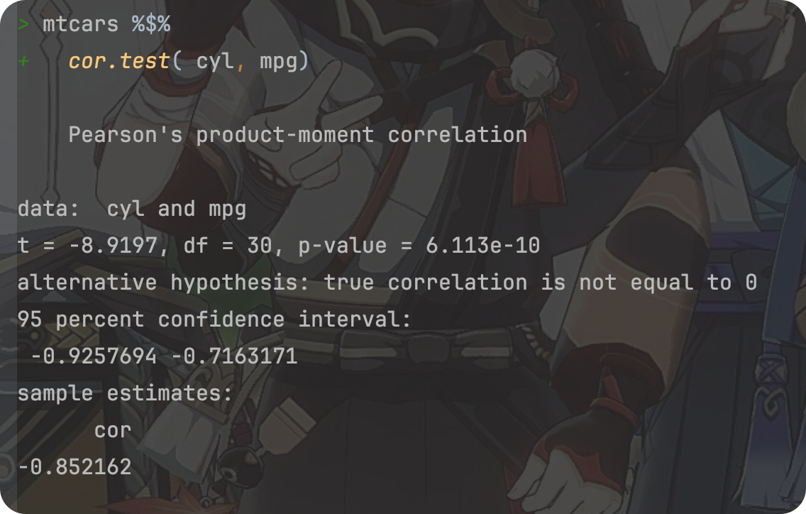

# Review of the course “R for Data Science” Part 02(Talk 05~ 08)

**<font size = 5>Click [here](./index.html) to return to the homepage.</font>**

**<font size = 5>Click [here](./REVIEW_01.html) to return to part 01.</font>**

---

<font size = 1>**By Haoran Nie @ HUST Life ST**</font>

<font size = 1>**Partically translated by [Rui Zhu @ HUST Life ST](https://github.com/1508324011)**</font>

<font size = 1>**双语版**</font>

> Reference: [R for Data Science](https://r4ds.had.co.nz)
>
> The book updated to 2^nd^ ed. on July,2023, here’ s a [link](https://r4ds.hadley.nz) to the official website.

<p xmlns:cc="http://creativecommons.org/ns#" >This work is licensed under <a href="http://creativecommons.org/licenses/by-nc-sa/4.0/?ref=chooser-v1" target="_blank" rel="license noopener noreferrer" style="display:inline-block;">CC BY-NC-SA 4.0</a></p>

---

# R for bioinformatics, data wrangler, part 1

> Talk 05
>
> View the original slide through [this link](https://github.com/Lucas04-nhr/R-for-Data-Science/blob/main/talk05.pdf).
>
> View the original R markdown file of the slide through [this link](https://github.com/Lucas04-nhr/R-for-Data-Science/blob/main/talk05.Rmd).

## Pipe in R

### What is pipe in R?

-   pipe 就是 `%>%`.
-   It comes from the `magrittr` package by **Stefan Milton Bache**.
-   Packages in the `tidyverse` load `%\>%` for you automatically, so you don't usually load `magrittr` explicitly.
-    实质是中间值的传递

**Example**

```R
library(tidyverse)
library(magrittr)
a =
 subset(swiss, Fertility > 20)
cor.test(a$Fertility, a$Education)
```


The code above can be replaced by:

```R
swiss %>%
  subset(., Fertility > 20) %$%
  cor.test(Education, Fertility)
```


所有函数都支持 pipe,通常需要用 `.` 指代传递来的数据，并以参数的形式赋予下游函数

- **`%>%`**：最常见的管道操作符，用于将左侧表达式的结果作为右侧表达式的第一个参数。在这种情况下，右侧表达式的结果会成为整个管道表达式的结果。
- **`%T>%` **：将左侧表达式的结果传递给右侧表达式。然而，与 `%>%` 不同的是，整个管道表达式的结果是左侧表达式的结果，而不是右侧表达式的结果。
- **`%$%` **:允许你在管道的右侧直接访问左侧对象的内部元素，而无需重复指定左侧对象的名称。特别适合用于那些需要从同一个数据对象中提取多个元素进行操作的情况，这在处理复杂的表达式时特别有用，可以使代码更加简洁和清晰。
- **`%<>%` **:结合了 `%>%` 和赋值操作的功能，允许你在对一个对象进行操作的同时更新这个对象本身。这意味着你可以在管道中对一个对象进行一系列的操作，并且这些操作的结果会直接反映到原始对象上，而不需要进行额外的赋值步骤。特别适用于数据处理和清理的场景，其中你需要对一个数据对象进行一系列的操作，并希望操作的结果直接更新到这个对象上。这样可以使得代码更加整洁，并减少潜在的错误，因为你不需要记住为每个中间步骤创建一个新的变量。

### egs:

- `%T>%`: 返回上游值 (left-side values),操作符在那些需要执行某些操作但不改变原始数据的场景中非常有用。例如，你可能想要打印或绘制原始数据的某些特性，同时保持数据本身不变以便后续操作。

```R
res1 <- 
  rnorm(100) %>%
    matrix(ncol = 2) %>%
    plot()#此步骤将整个流程的结果赋值给 res1。但 plot() 函数不会返回数据，所以 res1 将不包含任何数据。

res2 <- 
  rnorm(100) %>%
    matrix(ncol = 2) %T>%
    plot();#由于使用 %T>%，res2 将包含步骤 2 中生成的矩阵，而不是 plot() 的输出

```

- `%$>%`: Attach …

```R
attach( mtcars ); ## note the warning message ... 
cor.test( cyl, mpg ); ## 汽缸数与燃油效率

detach( mtcars );
with( mtcars, cor.test( cyl, mpg ) );

mtcars %$% 
cor.test( cyl, mpg );
```



- `%<>%`

```{r}
## 双向 pipe 
mtcars %<>% transform(cyl = cyl * 2);
```

#### <font color = red>**ATTENTION**</font>

1. pipe 的使用可以使思路更清晰
-   因此，尽量使用 `%>%` （方向明确），而不使用其它方向不明确的 pipe

---

## Data Wrangler - `dplyr`

### What is `dplyr`?

-   The next iteration of `plyr`,
-   Focusing on only data frames (also tibble),
-   Row-based manipulation,
-   `dplyr` is faster and has a more consistent API.

`dplyr` provides a consistent set of verbs that help you **solve the most common data manipulation challenges**:

1. `select()`

- **功能**：`select()` 用于从数据框中选择一列或多列。
- **常见用法**：`select(data, column1, column2, ...)`
- 参数
  - `data`：数据框对象。
  - `column1, column2, ...`：要选择的列的名称。

2. `filter()`

- **功能**：`filter()` 用于根据条件筛选数据框中的行。
- **常见用法**：`filter(data, condition)`
- 参数
  - `data`：数据框对象。
  - `condition`：筛选条件，可以是逻辑表达式。

3. `mutate()`

- **功能**：`mutate()` 用于在数据框中添加新列或修改现有列。
- **常见用法**：`mutate(data, new_column = expression)`
- 参数
  - `data`：数据框对象。
  - `new_column = expression`：创建或修改列的表达式。

4. `summarise()`

- **功能**：`summarise()` 用于对数据框中的数据进行汇总或聚合操作。
- **常见用法**：`summarise(data, summary = function(column))`
- 参数
  - `data`：数据框对象。
  - `summary = function(column)`：汇总或聚合操作，如求和、平均等。

5. `arrange()`

- **功能**：`arrange()` 用于根据一列或多列对数据框中的行进行排序。
- **常见用法**：`arrange(data, column)`
- 参数
  - `data`：数据框对象。
  - `column`：用于排序的列。可以添加多列进行多级排序。

## e.g.

### 查看 mouse.tibble 的内容

```R
# Read the file
library(tidyverse)
mouse.tibble =
  read_delim(
    file = "data/mouse_genes_biomart_sep2018.txt",
    delim = "\t",
    quote = "",
    show_col_types = FALSE
  )

# View mouse.tibble content
ttype.stats =
  mouse.tibble %>%
    count(`Transcript type`) %>%
    arrange(-n)

# View mouse.tibble content, cont.
chr.stats =
  mouse.tibble %>%
    count(`Chromosome/scaffold name`) %>%
    arrange(-n)
```

<center></center>

### 分析任务

1.  将染色体限制在常染色体和XY上（去掉未组装的小片段） ; 处理行
2.  将基因类型限制在 protein_coding, miRNA和 lincRNA 这三种；处理行
3.  统计每条染色体上不同类型基因（protein_coding, miRNA, lincRNA）的数量
4.  按染色体（正）、基因数量（倒）进行排序

### 用 `dplyr` 实现

```{r}
dat <- mouse.tibble %>% 
  ## 1. 
  
  filter( `Chromosome/scaffold name` %in% c( 1:19, "X", "Y" )   ) %>% 
  
  ## 2. 
  filter( `Transcript type` %in% c( "protein_coding", "miRNA", "lincRNA" ) ) %>%
  
  ## change column name ... 
  select( CHR = `Chromosome/scaffold name`, TYPE = `Transcript type`, 
          GENE_ID = `Gene stable ID`, 
          GENE_LEN =  `Transcript length (including UTRs and CDS)`  ) %>%
  
  ## 3. 
  group_by( CHR, TYPE ) %>% 
  summarise( count = n_distinct( GENE_ID ), mean_len = mean( GENE_LEN ) ) %>% 
  
  ## 4. 
  arrange(  CHR  , desc( count ) );
```

### 检查运行结果

```{r echo=FALSE}
knitr::kable( head( dat, n = 15 ) );

CHR	TYPE	          count	mean_len
1	  protein_coding	1200	2699.59009
1	  lincRNA	        347	  1206.76149
1	  miRNA	          128	  97.97656
10	protein_coding	1020	2408.16454
10	lincRNA	        398  	1220.35543
10	miRNA	          91	  89.87912
11	protein_coding	1640	2431.87666
11	lincRNA	        189 	1134.49174
11	miRNA	          137	  87.48905
12	protein_coding	644	  2523.94822
12	lincRNA	        327	  1277.14979
12	miRNA	          146	  86.24658
13	protein_coding	831	  2380.41499
13	lincRNA	        428	  1251.04552
13	miRNA	          97	  105.52577
```

---

# R for bioinformatics, data wrangler, part 2

> Talk 06
>
> View the original slide through [this link](https://github.com/Lucas04-nhr/R-for-Data-Science/blob/main/talk06.pdf).
>
> View the original R markdown file of the slide through [this link](https://github.com/Lucas04-nhr/R-for-Data-Science/blob/main/talk06.Rmd).

## `tidyr`

-   `pivot_longer()`  to take the place of `gather`
-   `pivot_wider()`  to take the place of `spread`

## Data Wrangler - `tidyr`

You can get `tidyr` in the package set `tidyverse`, or simply install it the first time you want to use it via `install.packages("tidyr")`.

## 宽数据的特点

### 优点：

-    自然，易理解；

### 缺点：

-    不易处理；
-    稀疏时问题较大；

### The usage of `tidyr`

- 宽和长数据的相互转换


```R
# Eg 1
library(tidyverse)
grades2 =
	read_tsv(file = "data/grades2.txt")

grades3 =
	grades2 %>% 
	pivot_longer( 
    - name,#所有除 name 列之外的列将被转换为长格式。
    names_to = "course",#宽格式中的列名（如课程名称）将被转换并存储在名为 course 的新列中。
    values_to = "grade"#原始数据框中的值（如成绩）将被转换并存储在名为 grade 的新列中。
  )

# Eg 2
grades3_wide = grades3_long %>% 
  pivot_wider(
    names_from = "course",# course 列的值将成为宽格式数据框的新列名。
    values_from = "grade"#grade 列的值将填充到相应的新列中。
  )
```

### If you meet `NA` in the 1st example, you can do like this:

```R
grades3_1 =
	grades3[!is.na(grades3$grade), ]
grades3_2 =
	grades3[complete.cases(grades3), ]

# A better solution
grades3_long = grades2 %>% 
  pivot_longer( - name, 
                names_to = "course", 
                values_to = "grade",
                 values_drop_na = TRUE#删除任何包含 NA 的行。结果中只会包含完整的、没有缺失值的记录。
              )

# Pay attention to the variant named "values_drop_na"
```

### More functions in `tidyr`: (See @ https://r4ds.hadley.nz/data-tidy.html)

### `tidyr::separate()`

将包含多个信息的单一列分割成多个列，以便于进行更深入的数据分析和可视化。

- `data`: 数据框。
- `col`: 需要被分割的列。
- `into`: 一个字符串向量，包含新列的名称。
- `sep`: 分割符号。默认是非字母数字字符。
- `remove`: 是否移除原始列，默认为 `TRUE`。
- `convert`: 如果设置为 `TRUE`，尝试自动将分割后的字符串转换为适当的数据类型。

**Usage:**

```R
separate(
  data,
  col,
  into,
  sep = "[^[:alnum:]]+",
  remove = TRUE,
  convert = FALSE,
  extra = "warn",
  fill = "warn",
  ...
)

# Default parameters are listed.
```

### `tidyr::unite()`

将多个列合并成一个单独的列。

- `data`: 数据框。
- `new_col`: 合并后的新列的名称。
- `col1, col2, ...`: 需要合并的列。
- `sep`: 合并时使用的分隔符，默认为下划线（`_`）。
- `remove`: 是否移除原始列，默认为 `TRUE`。

**Usage:**

```R
unite(
  data,
  new_col, 
  col1, col2, ..., 
  sep = "_", 
  remove = TRUE, 
  na.rm = FALSE
)

# Default parameters are listed.
```

---

# R for bioinformatics, Strings and regular expression

> Talk 07
>
> View the original slide through [this link](https://github.com/Lucas04-nhr/R-for-Data-Science/blob/main/talk07.pdf).
>
> View the original R markdown file of the slide through [this link](https://github.com/Lucas04-nhr/R-for-Data-Science/blob/main/talk07.Rmd).

## `stringr`

1. basics

 * length
 * uppercase, lowercase
 * unite, separate
 * string comparisons, sub string

2. regular expression

Before you start…

```R
library(stringr)
```

### Also notice other famous packages used to manipulating string:

 `stringi`(Following are based on the official R Documentation)

#### **Description**

​	`stringi` is THE R package for fast, correct, consistent, and convenient string/text manipulation. It gives predictable results on every platform, in each locale, and under any native character encoding.

------

### Usage of `writeLines()` (from official R Documentation)

#### Description

Write text lines to a connection.

#### Usage

```
writeLines(text, con = stdout(), sep = "\n", useBytes = FALSE)
```

#### Arguments

|   `text`   |                      A character vector                      |
| :--------: | :----------------------------------------------------------: |
|   `con`    | A [connection](vscode-webview://00i87qrgljff0t3jmc9gjufilst9usetvkh9gn773om0ic67o1j2/base/help/connection) object or a character string. |
|   `sep`    | character string. A string to be written to the connection after each line of text. |
| `useBytes` |                   logical. See ‘Details’.                    |

#### Details

如果``con``是一个字符串，函数调用`file`来获得一个文件连接，该文件连接在函数调用期间被打开。 ([tilde expansion](vscode-webview://00i87qrgljff0t3jmc9gjufilst9usetvkh9gn773om0ic67o1j2/base/help/tilde expansion) of the file path is done by `file`.)

如果连接是打开的，则从其当前位置写入。如果未打开，则在`wt`模式下在调用期间打开，然后再次关闭。

正常情况下，`writeLines`用于文本模式连接，默认分隔符转换为该平台的正常分隔符（Unix/Linux上为LF,Windows上为CRLF）。为了获得更多的控制，打开一个二进制连接，并在`sep`中指定要写入文件的精确值。为了更好的控制，在二进制连接上使用`writeChar`。

`useBytes` is for expert use. Normally (when false) character strings with marked encodings are converted to the current encoding before being passed to the connection (which might do further re-encoding). `useBytes = TRUE` suppresses the re-encoding of marked strings so they are passed byte-by-byte to the connection: this can be useful when strings have already been re-encoded by e.g. `iconv`. (It is invoked automatically for strings with marked encoding `"bytes"`.)

### Difference between double quote(`“”`) and single quote(`‘’`)

In R and its string manipulation package `stringr`, there is no difference between strings defined with double quotes (`"`) and single quotes (`'`). Both are used to define strings and you can use either depending on your preference or the situation.

例如，如果字符串包含单引号，您应该用双引号将字符串括起来，反之亦然。Here's an example:

```R
# Using double quotes when the string contains a single quote
string1 = "It's a beautiful day"

# Using single quotes when the string contains a double quote
string2 = 'He said, "Hello, world!"'
```

In both cases, R will interpret the contents between the quotes as a string. 

### Some of the functions in the `stringi` package are similar in function to those that come with the system.

Here are some functions in the `stringi` package that share similar functionalities with base R's string functions, along with examples showcasing their differences:

1. **`stri_length()` vs. `nchar()`**:

   - `stri_length()` in `stringi` calculates the number of code points in a string, accounting for Unicode characters.
   - `nchar()` in base R counts the number of characters in a string, but it might not handle Unicode characters as accurately as `stri_length()`.

   ```R
   library(stringi)
   
   # Using stri_length from stringi
   string = "café"
   stri_length(string)
   # Output: 4
   
   # Using nchar from base R
   nchar(string)
   # Output: 4
   ```

   In this example, both `stri_length()` and `nchar()` return the same count for ASCII characters. However, when dealing with Unicode characters, `stri_length()` can accurately count them as individual code points, whereas `nchar()` might not handle them correctly.

1. **`stri_split_*()` vs. `strsplit()`**:

   - `stri_split_*()` functions in `stringi` split a string based on various criteria like fixed patterns, regular expressions, or character classes.
   - `strsplit()` in base R performs a similar operation but might differ in handling certain edge cases and Unicode characters.

   ```R
   # Using stri_split_* from stringi
   string = "apple, orange, café"
   stri_split_fixed(string, pattern = ", ")
   # Output: list("apple", "orange", "café")
   
   # Using strsplit from base R
   strsplit(string, split = ", ")
   # Output: list("apple", "orange", "caf", "é")
   ```

   Here, `stri_split_fixed()` correctly splits the string, including the accented character "é," while `strsplit()` treats the accented "é" as two separate characters due to how it handles Unicode.

1. **`stri_detect()` vs. `grepl()`**:

   - `stri_detect()` in `stringi` checks if a pattern exists in a string and returns a logical value.
   - `grepl()` in base R performs a similar task but might differ in its handling of Unicode characters and certain pattern matching options.

   ```R
   # Using stri_detect from stringi
   string = "This is a café"
   stri_detect(string, regex = "café")
   # Output: TRUE
   
   # Using grepl from base R
   grepl("café", string)
   # Output: FALSE
   ```

   In this example, `stri_detect()` correctly detects the presence of the word "café," while `grepl()` returns a different result due to potential differences in Unicode handling or pattern matching options.

The examples highlight how `stringi` functions like `stri_length()`, `stri_split_*()`, and `stri_detect()` differ from their base R counterparts (`nchar()`, `strsplit()`, and `grepl()`) by providing more accurate handling of Unicode characters and often more versatile string manipulation options.

### Some of the functions in the `stringr` package are similar in function to those that come with the system.

Here are examples comparing some functions from the `stringr` package with their counterparts from base R:

### string length

1. **`str_length()` vs. `nchar()`:**

```R
library(stringr)

# Using str_length from stringr
string = c("apple", NA, "banana", "")
str_length(string)
# Output: 5   NA   6   0

# Using nchar from base R
nchar(string)
# Output: 5  NA   6   0
```

``str_length()``和``nchar()``都计算每个字符串元素中的字符数。然而，``str_length()``通过返回`NA`来更一致地处理缺失值，而``nchar()``在某些情况下可能会以不同的方式处理`NA`。

2. **`str_sub()` vs. `substr()`:**

```R
# Using str_sub from stringr
string = c("hello", "world", "example")
str_sub(string, start = 2, end = 4)
# Output: "ell" "orl" "xam"

# Using substr from base R
substr(string, start = 2, stop = 4)
# Output: "ell" "orl" "xam"
```

`str_sub()`和`substr()`都根据指定的开始和结束位置提取子字符串。然而，`str_sub()`允许负索引从字符串的末尾开始计数，并且它更一致地处理缺失值。

3. **`str_replace()` vs. `sub()` or `gsub()`:**


```R
# Using str_replace from stringr
string = c("apple pie", "banana bread", "cherry cake")
str_replace(string, pattern = "a", replacement = "X")
# Output: "Xpple pie"    "bXnana bread" "cherry cXke" 

# Using sub from base R
sub(pattern = "a", replacement = "X", x = string)
# Output: "Xpple pie" "bXnana bread" "cherry cXke"
```
`str_replace()`和``sub()``都用于替换字符串的部分内容。然而，`str_replace()`有一个更直观的界面，与``sub()``相比，它能更优雅地处理缺失值。

4. **`paste()`vs.`str_c()`**

### string combine 

```{r}
## 系统自带
paste( "a", "b", "c", sep = "" );
#[1] "abc"

## stringr 
str_c( "a", "b", "c" );
#[1] "abc"
```

### string comparison

**`strcmp` 函数：**

- **参数：**
  - `str1`：第一个字符串。
  - `str2`：第二个字符串。
- **返回值：**
  - logical, i.e. `TRUE` if `s1` and `s2` have the same length as character vectors and all elements are equal as character strings, else `FALSE`.

**`strcmpi` 函数：**

- **参数：**
  - `str1`：第一个字符串。
  - `str2`：第二个字符串。
- **返回值：**
  - 类似于 `strcmp`，但是在不区分大小写的情况下进行比较。

```{r}
## direct comparison ; 可用于排序 ...
"A" > "abc";
#[1] FALSE

## 
library(pracma);
strcmp( "chen", "chenweihua" );
strcmpi( "chen", "CHEN" );

#
#[1] FALSE
#[1] TRUE
```

These examples demonstrate how `stringr` functions can be more consistent and user-friendly in handling various string operations compared to their base R counterparts.

###  **(In the slide)** Difference between `toupper()`, `tolower()` and `stri_reverse()`

The functions `toupper()` and `tolower()` in base R and `stri_reverse()` in the `stringi` package perform similar tasks, but there are some differences in their functionality and usage:

1. **`toupper()` and `tolower()` in Base R:**

   - `toupper()` 将字符串中的字符转换为大写。
   - `tolower()` 将字符串中的字符转换为小写。

   ```R
   # Using toupper and tolower from base R
   string = "Hello World!"
   
   toupper(string)
   # Output: "HELLO WORLD!"
   
   tolower(string)
   # Output: "hello world!"
   ```

   These functions are straightforward and work well for ASCII characters, converting them to uppercase or lowercase, respectively. However, they might not handle Unicode characters or locale-specific transformations.

1. **`stri_reverse()` in `stringi`:**

   - `stri_reverse()` 颠倒字符串中字符的顺序，包括处理多字节字符和Unicode序列。

   ```R
   library(stringi)
   
   # Using stri_reverse from stringi
   string = "café"
   
   stri_reverse(string)
   # Output: "éfac"
   ```

   `stri_reverse()` reverses the characters in the string accurately, even when dealing with Unicode characters or multibyte sequences. It ensures correct reversal of characters irrespective of their encoding.

The key distinction lies in the handling of character cases and character sequence reversal. While `toupper()` and `tolower()` focus on case transformations for ASCII characters, `stri_reverse()` in `stringi` concentrates on accurately reversing character sequences, making it more suitable for handling multibyte characters and Unicode strings.

### Tricks

* ``` stringi ``` The functions in the package all start with ``` stri_ ```.
* ``` strinr ``` starts with ``` str_ ```.

## Regex - Regular Expression

1. Character classes:What characters are (not) matched?

   

```{r}
## 比如： [ab] 表示寻找a 或 b 
c( "abc", "chen", "liu", "blah" ) %>% str_subset( "[ab]" );

#[1] "abc"  "blah"

## 匹配并取出字符中间的数字 
c( "a1334bc", "ch13e_45n", "liu", "bl00ah" ) %>% str_extract( "\\d+" );

#[1] "1334" "13"   NA     "00" 
```

```R
# Example 01
"abc_123_??$$^" %>% str_extract("\\s+") # Does this string include spaces? 
"abc_123_??$$^" %>% str_extract("\\d+") # Numbers? 
"abc_123_??$$^" %>% str_extract("\\w+") # [A-z0-9_]

[1] NA
[1] "123"
[1] "abc_123_"
```

```str_extract``` : Take out the first match.

2. Matching position

   

```R
# Example 02
# STRING ending in 'wei'
c("chen wei hua", "chen wei", "chen") %>% str_subset("wei$")

#[1] "chen wei"

# CHARACTER ending in 'wei' 
c("chen wei hua", "chen wei", "chen") %>% str_subset("wei\\b")

#[1] "chen wei hua" "chen wei"   
```

3. Number of matches

```R
# Example 03
"1234abc" %>% str_extract("\\d+")
"1234abc" %>% str_extract("\\d{3}")
"1234abc" %>% str_extract("\\d{5,6}")
"1234abc" %>% str_extract("\\d{2,6}")

[1] "1234"
[1] "123"
[1] NA
[1] "1234"
```

4. Classes and groups

   

4. Special characters

   
   
   ### tasks of regular expression 
   
   detect patterns ： 检查目标string里有无pattern
   
   ```{r}
   grep( "\\d+", c( "123", "abc", "wei555hua" ) ); ## 
   grepl( "\\d+", c( "123", "abc", "wei555hua" ) ); ## 
   c( "123", "abc", "wei555hua" ) %>% str_detect( "\\d+" );
   #
   [1] 1 3
   [1]  TRUE FALSE  TRUE
   [1]  TRUE FALSE  TRUE
   ```
   
   **count patterns：统计匹配的数量**
   
   ```{r}
   x <- c("why", "video", "cross", "extra", "deal", "authority");
   str_detect(x, "[aeiou]");
   
   str_count(x, "[aeiou]");
   #
   [1] FALSE  TRUE  TRUE  TRUE  TRUE  TRUE
   [1] 0 3 1 2 2 4
   ```
   
   locate patterns (定位)
   
   ```{r}
   regexpr( "\\d+", c( "123", "abc", "wei555hua" ) ); ## 
   #
   [1]  1 -1  4
   attr(,"match.length")
   [1]  3 -1  3
   attr(,"index.type")
   [1] "chars"
   attr(,"useBytes")
   [1] TRUE
   ```
   
    extract patterns (抽取匹配的字串)
   
   ```{r}
   c( "123", "abc", "wei555hua" ) %>% str_extract ( "\\d+" );
   c( "123", "abc", "wei555hua" ) %>% str_match ( "\\d+" );
   ```
   
   ### useful tools 
   
   https://regexr.com/
   https://regex101.com/
   
   ### `str_extract` vs. `str_match`
   
   **`str_extract`：**
   
   - **功能：** 用于从字符串中提取匹配正则表达式的部分。
   - **返回值：** 返回匹配到的第一个子字符串（或整个字符串）。
   
   **`str_match`：**
   
   - **功能：** 用于从字符串中提取匹配正则表达式的全部信息，包括所有匹配的子字符串和捕获组。
   - **返回值：** 返回一个矩阵，每一行表示一个匹配，每一列表示一个捕获组。
   
   ```{r}
   x;
   #
   [1] "why"       "video"     "cross"     "extra"     "deal"     
   [6] "authority"
   
   str_extract(x, "[aeiou]");
   
   #
   [1] NA  "i" "o" "e" "e" "a"
   
   str_match(x, "(.)[aeiou](.)"); ## extract the characters on either side of the vowel ????
   
   #
        [,1]  [,2] [,3]
   [1,] NA    NA   NA  
   [2,] "vid" "v"  "d" 
   [3,] "ros" "r"  "s" 
   [4,] NA    NA   NA  
   [5,] "dea" "d"  "a" 
   [6,] "aut" "a"  "t" 
   ```
   
   ## `str_extract_all` 和 `str_match_all` 
   
   **`str_extract_all`：**
   
   - **功能：** 用于从字符串中提取所有匹配正则表达式的部分。
   - **返回值：** 返回一个列表，其中每个元素是一个字符向量，包含与正则表达式匹配的所有子字符串。
   
   **`str_match_all`：**
   
   - **功能：** 用于从字符串中提取所有匹配正则表达式的全部信息，包括所有匹配的子字符串和捕获组。
   - **返回值：** 返回一个列表，其中每个元素是一个矩阵，表示一个匹配，矩阵的每一列表示一个捕获组。
   
   ```{r}
   x;
   str_extract_all( x, "[aeiou]+" );
   str_match_all( x, "[aeiou]+" );
   ```
   
    replace patterns (匹配并替换)
   
   ```{r}
   str_replace( c( "123", "abc", "wei555hua" ) , "\\d+", "###");
   str_replace_all( "123_abc_456_789" , "\\d+", "###");
   
   #[1] "###"       "abc"       "wei###hua"
   #[1] "###_abc_###_###"
   ```
   
    split by patterns
   
   ```{r}
   str_split(x, "");
   ```

---

# R for bioinformatics, data iteration & parallel computing

> Talk 08
>
> View the original slide through [this link](https://github.com/Lucas04-nhr/R-for-Data-Science/blob/main/talk08.pdf).
>
> View the original R markdown file of the slide through [this link](https://github.com/Lucas04-nhr/R-for-Data-Science/blob/main/talk08.Rmd).

## TOC

* for loop
* ``` apply ``` functions 
* The essence of ``dplyr`` is traversal.
* ``` map ``` functions in ```purrr ``` package 
* Iteration and Parallel Computing

## Iteration Basics 

### `for loop` , getting data ready

Look at this example:

```R
df =
	tibble( 
    a = rnorm(100), 
    b = rnorm(100), 
    c = rnorm(100), 
    d = rnorm(100)
  )

# Calculate row means 
res1 =
	vector("double", nrow(df))
for(row_idx in 1:nrow(df)){
  res1[row_idx] =
  	mean( as.numeric(df[row_idx, ]))
}

res2 = c()
for(row_idx in 1:nrow(df)){
  res2[length(res2) + 1] =
  	mean(as.numeric(df[row_idx, ]))
}

# Similar to Python

# Calculate column means 
res2 =
	vector("double", ncol(df))
for(col_idx in 1:ncol(df)){
  res2[col_idx] =
  	mean(df[[col_idx]])
}
```

You can replace it with `for loop`:

```R
rowMeans(df)
colMeans(df)
```

Here are some other functions:

```R
rowSums(df)
colSums(df)
```

### `apply` functions

``` apply(X, MARGIN, FUN, ...) ```; 

MARGIN : 1 = 行， 2 = 列； c(1,2) = 行&列

FUN : 函数，可以是系统自带，也可以自己写

You can use `apply` with customizable function.

```R
df %>% apply(
  ., 
  2, 
  function(x) { 
    return(
      c(
        n = length(x), 
        mean = mean(x), 
        median = median(x) 
      )
    )
  } 
)
```

### Something about `tapply()`:

The `tapply()` function in R 用于在向量的子集上应用函数，通过因子或因子列表将其拆分。 It stands for "table apply" and is particularly useful for summarizing data by groups or categories.

Here's a breakdown of its usage:

```R
tapply(X, INDEX, FUN)
```

用 **index**   将   **x**   分组后，用    **fun**  进行计算

- `X`: 要对其应用函数的向量（或数组）。
- `INDEX`:定义组的因子或因子列表。These factors determine how the vector `X` is split.
- `FUN`: The function to be applied to each subset of `X`.

For example:

```R
## 注意 pipe 操作符的使用
mtcars %$% tapply( mpg, cyl, mean ); ## 汽缸数 与 每加仑汽油行驶里程 的关系
#
       4        6        8 
26.66364 19.74286 15.10000 
```

然而，使用``` dplyr ``` 思路会更清晰

```{r warning=FALSE, message=FALSE, eval=FALSE}
mtcars %>% group_by( cyl ) %>% summarise( mean = mean( mpg ) );
```

``` tapply ``` 和 ``` dplyr ``` 都是基于行的操作！！

``` lapply ``` 和 ``` sapply ``` 

基于**列**的操作

输入：

* vector ： 每次取一个 element 
* data.frame, tibble, matrix : 每次取一列
* list ： 每次取一个成员 

输入是 tibble 

```{r}
df %>% lapply( mean );
df %>% sapply( mean );
```

输入是 list ，使用自定义函数

```{r}
list( a = 1:10, b = letters[1:5], c = LETTERS[1:8] ) %>% 
  sapply( function(x) { length(x) } );
```

* ``` lapply ``` 是针对列的操作 
* 输入是 tibble, matrix, data.frame 时，功能与 ``` apply( x, 2, FUN ) ``` 类似 ... 

### Diffrences between `apply` in base R and the package `dplyr`:

1. **`apply` functions in base R:**

   - The `apply` family of functions (`apply()`, `lapply()`, `sapply()`, `vapply()`, etc.) in base R are used for applying a function over margins of arrays or data structures like matrices, arrays, and lists.
   - `apply()` is used primarily for applying functions to the rows or columns of matrices or arrays, while `lapply()` and `sapply()` are more focused on lists.
   - 这些函数对于跨行或跨列的重复操作非常有用，而无需显式使用循环。

    Example:

    ```R
    # Creating a matrix
    mat = matrix(1:12, nrow = 3, ncol = 4)
   
    # Applying sum function to rows (1) or columns (2) of the matrix
    apply(mat, 1, sum)  # Sums of each row
    apply(mat, 2, sum)  # Sums of each column
    ```

1. **`dplyr` package:**

   - `dplyr` is a powerful package in R for data manipulation and transformation. It provides a set of functions (`filter()`, `mutate()`, `select()`, `group_by()`, `summarize()`, etc.) that enable easy and intuitive data manipulation.
   - It's designed to work well with data frames and offers a more streamlined and readable syntax for performing common data manipulation tasks.

    Example:

    ```R
    library(dplyr)
   
    # Creating a sample data frame
    df = data.frame(
      Name = c("Alice", "Bob", "Charlie"),
      Age = c(25, 30, 28),
      Salary = c(40000, 50000, 45000)
    )
   
    # Filtering and selecting specific rows and columns
    filtered_df = df %>%
      filter(Age > 25) %>%
      select(Name, Salary)
   
    filtered_df
    ```

    This `dplyr` example filters rows where `Age` is greater than 25 and selects only the `Name` and `Salary` columns. The `%>%` operator (pipe) chains together multiple operations, making the code more readable and concise.

In summary, the `apply` family in base R is ideal for applying functions to matrices, arrays, or lists across rows or columns, while `dplyr` focuses on intuitive data manipulation operations for data frames, providing a cleaner syntax and ease of use for common data transformation tasks.

## More on iteration: `purrr` package

### About `purrr` (from official website https://purrr.tidyverse.org)

`purrr` enhances R’s functional programming (FP) toolkit by providing a complete and consistent set of tools for working with functions and vectors. If you’ve never heard of FP before, the best place to start is the family of `map()`functions which allow you to replace many for loops with code that is both more succinct and easier to read. The best place to learn about the `map()` functions is the [iteration chapter](https://r4ds.had.co.nz/iteration.html) in R for data science.

**Usage**

The following example uses `purrr `to solve a fairly realistic problem: split a data frame into pieces, fit a model to each piece, compute the summary, then extract the R^2^.

```R
library(purrr)

mtcars |> 
  split(mtcars$cyl) |>  # from base R
  map(\(df) lm(mpg ~ wt, data = df)) |> 
  map(summary) %>%
  map_dbl("r.squared")
  
#>         4         6         8 
#> 0.5086326 0.4645102 0.4229655
```

This example illustrates some of the advantages of `purrr` functions over the equivalents in base R:

+ The first argument is always the data, so purrr works naturally with the pipe.
+ All `purrr` functions are type-stable. They always return the advertised output type (`map()` returns lists; `map_dbl()` returns double vectors), or they throw an error.
+ All `map()` functions accept functions (named, anonymous, and lambda), character vector (used to extract components by name), or numeric vectors (used to extract by position).

### Detailed Usage

`purrr` is a powerful package in R that focuses on enhancing and simplifying the process of working with functions and vectors. Developed as part of the tidyverse ecosystem, `purrr` provides a consistent and coherent set of tools for functional programming, iteration, and working with lists and vectors.

Here are some key aspects and functionalities of `purrr`:

1. **Functional Programming:**
   - `purrr` promotes functional programming paradigms in R, enabling users to work with functions as first-class objects.
   - It provides functions like `map()`, `map2()`, `pmap()`, `walk()`, and more, which allow applying functions over elements of lists or vectors.

1. **Consistency Across Data Structures:**
   - `purrr` functions exhibit consistent behavior across various data structures, such as lists, vectors, and data frames.
   - These functions can work seamlessly with different data structures, making code more readable and maintainable.

1. **Iteration and Mapping:**
   - `map()` is a key function in `purrr` that iterates over elements of a list or vector, applying a function to each element and returning the results.
   - `map2()` is similar to `map()` but allows iterating over two vectors simultaneously.
   - `pmap()` extends this functionality to iterate over multiple vectors or lists simultaneously.

1. **Simplified and Cleaner Syntax:**
   - `purrr` functions often provide a more consistent and cleaner syntax compared to base R functions for similar operations.
   - The use of the pipe `%>%` from the tidyverse allows chaining `purrr` functions together, resulting in more readable code.

1. **Working with Lists and Data Frames:**
   - `purrr` provides functions to efficiently manipulate and iterate over elements in lists and data frames.
   - Functions like `map()` and `map_dbl()` can be used to apply functions to each column of a data frame and collect results in an output structure.

Example of `map()` in `purrr`:

```R
library(purrr)

# Applying sqrt function to each element of a list
numbers = list(a = 1:5, b = 6:10)
result = map(numbers, sqrt)

result
# Output: List of 2
# $ a: num [1:5] 1 1.41 1.73 2 2.24
# $ b: num [1:5] 2.45 2.65 2.83 3 3.16
```

This code applies the `sqrt()` function to each element of the list `numbers`, returning a list with the square roots of each element.

`purrr` simplifies and enhances functional programming in R, offering a consistent and expressive way to work with functions, lists, vectors, and data frames, making data manipulation and iteration more straightforward and concise.

### Examples

Here are some specific functionalities and examples of `purrr`:

1. **Mapping Functions:**

   ``` map( FUN ) ``` : 
   1. 遍历每列（tibble）或 slot （list），
   2. 运行 FUN 函数，
   3. 将计算结果返回至 list 

   对应： ``` lapply ``` 

    ```R
    library(purrr)
   
    # Squaring each element in a vector using map()
    numbers = 1:5
    squared = map(numbers, ~ .x^2)
   
    squared
    # Output: List of 5
    # $ : int 1
    # $ : int 4
    # $ : int 9
    # $ : int 16
    # $ : int 25
    ```

1. **Mapping Functions over Multiple Inputs:**

   `map2()` allows applying a function that takes two inputs to corresponding elements of two vectors.

    ```R
    # Multiplying elements of two vectors element-wise
    vector1 = 1:5
    vector2 = 6:10
    product = map2(vector1, vector2, ~ .x * .y)
   
    product
    # Output: List of 5
    # $ : int 6
    # $ : int 14
    # $ : int 24
    # $ : int 36
    # $ : int 50
    ```

1. **Working with Data Frames:**

   `map_df()` and similar functions allow applying a function to each column of a data frame and combining results into a data frame.

    ```R
    # Creating a data frame
    df = data.frame(A = 1:5, B = 6:10)
   
    # Doubling each column in the data frame
    doubled = map_df(df, ~ .x * 2)
   
    doubled
    # Output: A tibble: 5 × 2
    #       A     B
    #   <dbl> <dbl>
    # 1     2    12
    # 2     4    14
    # 3     6    16
    # 4     8    18
    # 5    10    20
    ```

1. **Iteration and Applying Functions:**

   `walk()` applies a function to each element without returning a result, useful for side effects or performing operations without output.

    ```R
   # Printing each element of a list using walk()
   fruits = list("apple", "banana", "orange")
   walk(fruits, print)
   # Output:
   # [1] "apple"
   # [1] "banana"
   # [1] "orange"
    ```

对应 ``` sapply ``` 的 ``` map_ ``` 函数

* ```map_lgl()``` makes a logical vector.
* ```map_int()``` makes an integer vector.
* ```map_dbl()``` makes a double vector.
* ```map_chr()``` makes a character vector.

```{r}
df %>% map_dbl( mean ); ## 注：返回值只能是单个 double 值
```

`purrr` simplifies functional programming by providing intuitive functions (`map()`, `map2()`, `walk()`, etc.) that allow iteration over elements, applying functions, and collecting results, making code more concise and readable in scenarios involving lists, vectors, and data frames.

### ``` map ``` 的高阶应用 

为每一个汽缸分类计算： 燃油效率与吨位的关系

```{r fig.height=4, fig.width=10}
plt1 <- 
  mtcars %>% 
  ggplot( aes( mpg, wt ) ) + 
  geom_point(  ) + facet_wrap( ~ cyl );
mtcars %>% 
split( .$cyl ) %>%
map( ~ cor.test( .$wt, .$mpg ) ) %>% 
map_dbl( ~.$estimate );
```

```split( .$cyl )``` : 由 ``` purrr```  提供的函数，将mtcars 按 cyl 列分为三个 tibble，返回值存入 list 

注意： ```. ``` 在 pipe 中代表从上游传递而来的数据；在某些函数中，比如 ```cor.test()``` ，必须指定输入数据，可以用 ```. ``` 代替。

```{r eval=FALSE}
## 正规写法：
map( function(df) { cor.test( df$wt, df$mpg ) } )
## 简写：
map( ~ cor.test( .$wt, .$mpg ) )
```

``` ~ ```  的用法 : 用于取代 ``` function(df) ```

```{r eval=FALSE}
## 完整版
map_dbl( function(eq) { eq$estimate} );
## 简写版
map_dbl( ~.$estimate )
```

### ``` split ``` 与  ``` group_by ``` 的区别

**`split`：**

- **功能：** `split` 函数用于将数据框或向量按照指定的因子或列表进行分割，生成一个列表，其中每个元素都包含原始数据的一个子集。

**`group_by`：**

- **功能：** `group_by` 函数通常与 `dplyr` 包一起使用，用于按照某一列或多列的值对数据进行分组。

### (in the slide) Function `reduce()` and `accumulate()`

Both `reduce()` and `accumulate()` are powerful functions from the `purrr` package that facilitate iterative calculations over a sequence, accumulating or reducing values based on a specified function.

Here's an explanation of each:

1. **`reduce()` Function:**

   - `reduce()`将列表的元素逐个进行二元操作，从左到右累积计算，最终返回一个单一的值。
   - The function provided to `reduce()` should take two arguments and return a single value.
   - It starts by applying the function to the first two elements, then uses the result along with the next element, and so on, until the sequence is exhausted.

   Example of `reduce()`:

   ```R
   library(purrr)
   
   # Summing all elements in a vector using reduce()
   numbers = 1:5
   total_sum = reduce(numbers, `+`)
   
   total_sum
   # Output: 15 (1 + 2 + 3 + 4 + 5 = 15)
   ```

   Here, `reduce()` adds all the elements in the `numbers` vector by applying the addition function (`+`) iteratively.

1. **`accumulate()` Function:**

   - `accumulate()` is similar to `reduce()`但返回的是一个累积计算的向量，而不是一个单一的值。它保留了每一步的计算结果。
   - It applies a function cumulatively to the sequence and returns a vector of values, representing the intermediate results at each step.

   Example of `accumulate()`:

   ```R
   # Calculating cumulative product of elements in a vector using accumulate()
   factors = c(2, 3, 4, 5)
   cumulative_product = accumulate(factors, `*`)
   
   cumulative_product
   # Output: 2 6 24 120 (2, 2*3, 2*3*4, 2*3*4*5)
   ```

   Here, `accumulate()` applies the multiplication function (`*`) to each element in `factors`, returning a vector of cumulative products at each step.

`reduce()` aggregates a sequence into a single value based on a function, while `accumulate()` returns a sequence of intermediate results. Both functions are helpful for iterative calculations and provide different ways to process sequences of values in R.

## Parallel Computing

### 并行计算介绍

并行计算一般需要3个步骤：

1. 分解并发放任务
2. 分别计算
3. 回收结果并保存

### Related Packages

- ```parallel``` 包：检测CPU数量；
- ```doParallel```包：将全部或部分 分配给任务
- ``` foreach ``` 包： 提供 ``` %do% ``` 和 ``` %dopar% ``` 操作符，以提交任务，进行顺序或并行计算 

  - `%do%` loop - foreach notation, but not parallel
  - `%dopar%` adds parallelization

- 辅助包：

  ``` iterators ``` 包： 将 data.frame, tibble, matrix 分割为行/列 用于提交并行任务。

### Step-by-step Guidance

1. **Prepare Data:**

   Assume you have a large data frame named `my_data` that you want to process in parallel.

1. **Setup Parallel Processing:**

   Load necessary packages and initialize parallel processing capabilities.

    ```R
    library(parallel)
    library(doParallel)
    library(foreach)
    library(iterators)
   
   
    # Set the number of cores/processors to be used
    num_cores = detectCores()## 检测有多少个 CPU 
   
    # Initialize parallel backend
    cl = makeCluster(num_cores)##创建了一个并行计算的集群
    registerDoParallel(cl)##将这个集群注册为后端，以便后续的并行计算使用。
    ```

1. **Split Data Frame into Chunks:**

   Use the `iter()` function from the `iterators` package to create an 迭代器 for chunks of your data frame.

    ```R
    # Define chunk size
    chunk_size = nrow(my_data) / num_cores
   
    # Create an iterator for the chunks
    my_iterator = iter(my_data, by = "row", chunksize = chunk_size)
    ```

1. **Perform Parallel Computation:**

   Use `foreach()` from the `foreach` package along with `%dopar%` to apply a function to each chunk in parallel.

    ```R
    # Define a function to process each chunk
    process_chunk = function(chunk) {
      # Your processing logic for each chunk goes here
      # For example: summary(chunk)
      # Replace summary() with your specific data processing task
    }
   
    # Apply the function to each chunk in parallel
    results = foreach(chunk = my_iterator, .combine = rbind) %dopar% {
      process_chunk(chunk)
    }
    ```

1. **Combine Results:**

   Collect and combine the results obtained from parallel processing.

    ```R
    # Combine or process the results obtained from parallel computation
    final_result = do.call(rbind, results)
   
    # Close the parallel cluster
    stopCluster(cl)
    ```


Replace the `process_chunk()` function with your specific data processing task. This approach parallelizes the processing of chunks of the data frame across multiple cores, allowing for faster computations, especially with large datasets.

**Note:** 

- When the task is completed, the allocated CPU core is reclaimed.
- Ensure that your specific data processing task is compatible with parallelization and that the benefits of parallel computing outweigh the overhead of parallelization. 
- Also, consider potential dependencies or shared resources among iterations when parallelizing computations.

### (in the slide) Function `foreach()`

### Simple usage

#### Description

`⁠%do%⁠` and `⁠%dopar%⁠` are binary operators that operate on a `foreach` object and an `R` expression. The expression, `ex`, is evaluated multiple times in an environment that is created by the `foreach` object, and that environment is modified for each evaluation as specified by the `foreach` object. `⁠%do%⁠` evaluates the expression sequentially, while `⁠%dopar%⁠` evaluates it in parallel. The results of evaluating `ex` are 求值的结果以列表形式返回，但可以通过`.confine`参数进行修改

``` .combine = 'c' ``` 参数的可能值：

* 'c' : 将返回值合并为 vector ；当返回值是单个数字或字符串的时候使用
* 'cbind' : 将返回值按列合并
* 'rbind' : 将返回值按行合并
* 默认情况下返回 ``` list ``` 

#### Usage

```R
foreach(
  ...,
  .combine,
  .init,
  .final = NULL,
  .inorder = TRUE,
  .multicombine = FALSE,
  .maxcombine = if (.multicombine) 100 else 2,
  .errorhandling = c("stop", "remove", "pass"),
  .packages = NULL,
  .export = NULL,
  .noexport = NULL,
  .verbose = FALSE
)
e1 %:% e2
when(cond)
obj %do% ex
obj %dopar% ex
times(n)
```

### 嵌套 (nested) foreach 

> Expanded knowledge, not featured on slide, for understanding only.

Nested `foreach` loops in R allow for the iteration over multiple levels of nested structures or combinations of iterators. This approach is particularly useful when dealing with hierarchical data or when you need to perform computations on multiple levels of nested objects simultaneously.

有些情况下需要用到嵌套循环，使用以下语法：

```{r eval=FALSE}
foreach( ... ) %:% {
  foreach( ... ) %dopar% {
    
  }
}

```

1. **Nested Iteration:**

   `foreach` supports nesting, allowing you to iterate over multiple levels of nested structures, such as lists within lists or matrices within lists.

   ```R
   library(foreach)
   
   # Example: Nested foreach loop iterating over a list of lists
   outer_list = list(list(a = 1, b = 2), list(c = 3, d = 4))
   
   foreach(inner_list = outer_list) %:% {
     foreach(element = inner_list) %do% {
       # Process each element within the nested structure
       print(element)
     }
   }
   ```

   This code iterates over each element of `outer_list`, which contains inner lists. Within each inner list, it iterates over the elements.

1. **Combining Iterators:**

   You can combine different iterators using `%:%` to create nested iterations.

   ```R
   # Example: Nested foreach loop with combined iterators
   values = 1:3
   letters = letters[1:4]
   
   foreach(i = values) %:% foreach(letter = letters) %do% {
     # Perform operations using both iterators
     print(paste("Value:", i, "| Letter:", letter))
   }
   ```

   This code creates nested iterations, iterating over `values` and `letters` simultaneously.

1. **Applying Nested Functions:**

   Nested `foreach` loops are valuable when applying functions or performing operations that require iterating over multiple levels of nested data structures or combinations.

   ```R
   # Example: Applying a function with nested foreach loops
   matrix_list = list(matrix(1:4, nrow = 2), matrix(5:8, nrow = 2))
   
   foreach(mat = matrix_list) %:% foreach(element = as.vector(mat)) %do% {
     # Perform computations on each element of each matrix
     print(element * 2)
   }
   ```

   Here, it iterates over a list of matrices and then iterates over each element within the matrices to perform computations.

Nested `foreach` loops in R allow for flexible and efficient iterations over hierarchical or nested structures, enabling complex computations, data manipulations, or simulations involving multiple levels of nested objects or iterators.


---

**<font size = 5>Click [here](./REVIEW_03.html) to go to part 03.</font>**