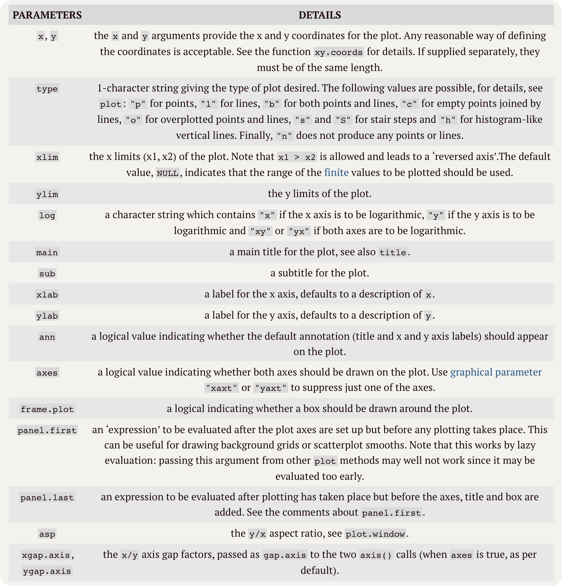

# Review of the course “R for Data Science” Part 03(Talk 09~ 12)

By Haoran Nie @ HUST Life ST**</font>

> Reference: [R for Data Science](https://r4ds.had.co.nz)
>
> The book updated to 2^nd^ ed. on July,2023, here’ s a [link](https://r4ds.hadley.nz) to the official website.

<p xmlns:cc="http://creativecommons.org/ns#" >This work is licensed under <a href="http://creativecommons.org/licenses/by-nc-sa/4.0/?ref=chooser-v1" target="_blank" rel="license noopener noreferrer" style="display:inline-block;">CC BY-NC-SA 4.0</a></p>

---

# R for bioinformatics, data visualisation

> Talk 09
>
> View the original slide through [this link](https://github.com/Lucas04-nhr/R-for-Data-Science/blob/main/talk09.pdf).
>
> View the original R markdown file of the slide through [this link](https://github.com/Lucas04-nhr/R-for-Data-Science/blob/main/talk09.Rmd).

## TOC

* basic plot functions
* basic `ggplot2` 
* special letters
* equations
* advanced `ggplot2`

## Basic plot functions using R

### Dot plot

**An example:**

```R
with( 
  swiss, 
  plot(
    Education, 
    Fertility,
    type = "p", 
    main = "Swiss data 1888", 
    sub = "Socioeconomic indicators & Fertility", 
    xlab = "Education", 
    ylab = "Fertility", 
    col = "darkblue", 
    xlim = range( Education ), 
    ylim = range( Fertility ), 
    pch = 20, 
    frame.plot = F
  ) 
)
```


**Function usage:**

```R
## Default S3 method:
plot(
  x, 
  y = NULL, 
  type = "p", 
  xlim = NULL, ylim = NULL,
  log = "", 
  main = NULL, sub = NULL, 
  xlab = NULL, ylab = NULL,
  ann = par("ann"), axes = TRUE, frame.plot = axes,
  panel.first = NULL, panel.last = NULL, asp = NA,
  xgap.axis = NA, ygap.axis = NA,
  ...
)
# Default Parameters are listed.
```

**Arguments**



You can also use `ggplot` to draw the plot above:

```R
ggplot( 
  swiss, 
  aes(x = Education, y = Fertility) 
) + 
geom_point() + 
scale_x_log10() + 
scale_y_log10() + 
xlab("Education") + 
ylab("Fertility") + 
ggtitle "Swiss data 1888")
```

### High-level and low-level

* **high level**: plotting functions create a new plot on the graphics device
* **low level**: plotting functions add more information to an existing plot

#### Low level plots

* ``` points ``` : dot plot
* ``` lines ``` : line plot
* ``` abline ``` : straightness
* ``` polygon ``` : polygonal
* ``` legend ``` : legend (of a map, etc)
* ``` title ``` ： caption
* ``` axis ``` : axis

#### High level plots

* ``` plot ``` : Generalized Graphing Functions
* ``` pairs ``` 
* ``` coplot ``` 
* ``` qqnorm ``` 
* ``` hist ``` 
* ``` dotchart ``` 
* ``` image ``` 
* ``` contour ``` 

**Notice**

You can force a high level function to be converted to low level with the ``` add = TRUE ``` parameter (if available).

### Graphics-related parameters (system functions)

You can use `par()` to view all the parameters current grafical device use.

**Remember to backup your default parameters before modyfy them.**

## `ggplot2`

You should know that

1. `xy -axes` will automatically adjust based on the data you give;

1. `ggplot2` plotting results can be saved in variables and more layers can be added;

1. Layers using their own data need to be specified with ``` data = ```, while global data is not. You can just specify it via ``` ggplot(data = data.frame(...)) ```.

### Some basic parameters of `ggplot2`

1. `geom` - Layer

	```geom_<name_of_the_layer>```

- ``` geom_point ``` , ```` geom_line ``` : A point and line plot used to reveal the relationship between two sets of data;

* ``` geom_smooth ``` : Often used in conjunction with ``` geom_point ``` to reveal the trend of data.

* ``` geom_bar ``` : bar charts

* ``` geom_boxplot ``` : A box plot, used to compare N sets of data, revealing differences.

* ``` geom_path ``` : similar to ``` geom_line ``` but can also draw other complex graphs

* ``` geom_histogram ```, `` geom_density `` : Distribution of data, can also be used to compare multiple groups.

	……

2. `scale` - Display Control

	`scale_<property_to _control>_<ways_to_control>`

- ```scale_color_...```

	- `..._gradient()`: use gradient colors for different numbers of variables and their colors.
		- `..._gradient2()`
		- `..._gradientn()`

	- `..._brewer`: use default color palettes.

- ```scale_fill_...```
	- `colour` defines the colour with which a geom is **outlined** (the shape's "stroke")
	* `fill`defines the colour with which a geom is **filled**
	* Points generally only have a `colour` and **no fill**
	* However, point shapes **21–25** that include **both** a colour and a fill.

- ```scale_shape_...```

- ```scale_size_...```

#### Palettes and corresponding functions in other packages

##### Included in `ggplot2`

`scale_color_hue`, `scale_color_manual`, `scale_color_grey`, `scale_colour_viridis_d`, `scale_color_brewer` ...

##### From the `RColorBrewer` package

`scale_color_brewer(palette = "<palette name>")`

##### From the `viridis` package

`scale_color_viridis(discrete=TRUE, option="<palette name>")` 

##### Other packages ...

* `paletteer` package: `scale_color_paletteer_xx` functions

* `ggsci` package

* `ggsci`: You can use it in your SCI article.

	* contents

		``` scale_color_<journal> ``` 和 ``` scale_fill_<journal> ``` functions and color palettes


	- supported journals
	
		* NPG `scale_color_npg()`, `scale_fill_npg()`
	
		* AAAS, NEJM, Lancet, JAMA ... 

3. `size`
3. `shape`

**Question:**

Parameters like `size`, `colour` etc. can be inside or outside `aes()`, what is the difference?

**Answer:**

In the internal case, the **size** is determined by the value of the specified column, or the **number** of colors and shapes is determined by the number of factors, and in the external case, the **specified value** prevails.

###  Coordinate System

1. Linear coordinate system

  * `coord_cartesian()`, 

	You can use parameters like `xlim()` & `ylim()` to **zoom in and out locally**.

  * `coord_flip()`, 

	This parameter exchanges the `x` and `y` axes.

  * `coord_fixed()`

	Draw plots in specific **aspect ratio**.

2. Nonlinear coordinate system

  * `coord_trans()`

	This parameter exchanges the `x` and `y` axes, **however**, it will plot the original figure, too.

  * `coord_polar()`

	The default parameter is `coord_polar(x)`.

  * `coord_map()`

	World Map

### `faceting`

panel, strip, axis, tick, tick label, axis label…

- `facet_wrap()`

	Use to specify the number of rows, columns and orientation.

	```R
	facet_wrap(
	  facets,
	  nrow = NULL,
	  ncol = NULL,
	  scales = "fixed",
	  shrink = TRUE,
	  labeller = "label_value",
	  as.table = TRUE,
	  switch = NULL,
	  drop = TRUE,
	  dir = "h",
	  strip.position = "top"
	)
	
	# Default parameters are listed.
	```

### Different layouts

Nothing to explain, for it’s too intricate.

## Formulas

> Similar to $\LaTeX$

You can just type the formula as exactly what you type in $\LaTeX$, and using `annotiate()` function to add it in your plot. 

**Remember to attach the library `latex2exp`**

```R
fig1 =
  fig1 +
  annotate(
    "text",
    x = 25,
    y = 15,
    label = paste0("y = ", eq, "x + (", intercept, ")\n","Shaded areas are confidence intervals."), # nolint
    family = "Aptos Serif"
  )
```

```R
... +
labs(
    x = TeX("Position of $P_2/\\phi$"),
    y = TeX("Light Intensity/$10^{-7}$A"),
    title = TeX("Intensity of Light with Different $\\phi$")
  )
```

 **Something about `hjust` and `vjust`**

```R
td = expand.grid(
    hjust=c(0, 0.5, 1),
    vjust=c(0, 0.5, 1),
    angle=c(0, 45, 90),
    text="text"
)

ggplot(td, aes(x=hjust, y=vjust)) + 
    geom_point() +
    geom_text(aes(label=text, angle=angle, hjust=hjust, vjust=vjust)) + 
    facet_grid(~angle) +
    scale_x_continuous(breaks=c(0, 0.5, 1), expand=c(0, 0.2)) +
    scale_y_continuous(breaks=c(0, 0.5, 1), expand=c(0, 0.2))
```

**You should always remember, the first step you want to draw a plot is to calculate the data.**

---

# R for bioinformatics, data summarisation and statistics

> Talk 10
>
> View the original slide through [this link](https://github.com/Lucas04-nhr/R-for-Data-Science/blob/main/talk10.pdf).
>
> View the original R markdown file of the slide through [this link](https://github.com/Lucas04-nhr/R-for-Data-Science/blob/main/talk10.Rmd).

## TOC

-   Data summarisation functions (vector data)

    -   median, mean, sd, quantile, summary

-   Graphical data summarisation (two-D data/ tibble/ table)

    -   dot plot
    -   smooth
    -   linear regression
    -   correlation & variance explained
    -   groupping & bar/ box/ plots

-   statistics

    -   parametric tests

        -   t-test
        -   one way ANNOVA
        -   two way ANNOVA
        -   linear regression
        -   model / prediction / coefficients

    -   non-parametric comparison

## Vector Summarization

### Describe Normal Distribution

You can use `mean` and `sd` to describe normal distributions.

- It's symmetrical.
-  Mean and median are the same.
-  Most common values are near the mean; less common values are farther from it.
- Standard deviation marks the distance from the mean to the inflection point.

### Functions to generate random normal distrubions

```R
qnorm()
pnorm()
dnorm()
```

### Other regular distributions

1. Uniform Distributions

	```R
	dunif(x, min = 0, max = 1, log = FALSE)
	punif(q, min = 0, max = 1, lower.tail = TRUE, log.p = FALSE)
	qunif(p, min = 0, max = 1, lower.tail = TRUE, log.p = FALSE)
	runif(n, min = 0, max = 1)
	```

1. Non-parametric Distributions

	Here’s an example:

	```R
	bi =
		c(7, 3, 2, 1, 7, 
	    3, 4, 5, 7, 6,
	    2, 2, 1, 3, 7, 
	    2, 6, 8, 2, 7,
	    2, 2, 1, 3, 5, 
	    8, 2, 6, 7, 8, 
	    6, 2, 8, 7, 9, 
	    2, 7, 5, 1, 8, 
	    8, 2, 3, 7, 3
	   )
	ggplot( 
	  data.frame(dat = bi),
	  aes(dat)) + 
	geom_density()
	```

### Quantitative descriptive data

- **mean**: aka average, is the sum of all of the numbers in the data set divided by the size of the data set;

- **median**: The median is the value that is in the middle when the numbers in a data set are sorted in increasing order;

- **sd**: standard deviation;

- **var**: measures how far a set of numbers are spread out;
- **range**: range of values.

### Quantitative descriptive function

Besides the function with the same name of the data above, `quantile` and `summary` are two quantitative descriptive functions.

**This chapter contains lots of functions and their usage, to know more, you can see them in the official R documentation, I only explane the things above here.**

## Statistics

### Parametric tests

#### `t-test`

Detect whether the distribution is consistent with expectations; e.g., whether the number of steps per day for boys is significantly different from 10,000.

The test assesses whether the means of two samples are significantly different from each other, assuming that the samples are normally distributed and have approximately equal variances.

There are different types of t-tests in R, depending on the nature of the comparison:

1. **One-Sample t-test:**

	Used to determine if the mean of a single sample differs significantly from a known or hypothesized population mean.

	Example:

	```
	RCopy code
	# One-sample t-test example
	sample_data = c(17, 21, 19, 23, 20, 18, 22)
	t.test(sample_data, mu = 20)
	```

	This code performs a one-sample t-test on `sample_data` to test if its mean differs significantly from 20.

1. **Independent Samples t-test (or Two-Sample t-test):**

	Compares the means of two independent groups to determine if they are significantly different from each other.

	Example:

	```
	RCopy code
	# Independent samples t-test example
	group1 = c(23, 25, 28, 22, 20)
	group2 = c(18, 21, 24, 19, 17)
	t.test(group1, group2)
	```

	This code performs an independent samples t-test on `group1` and `group2` to test if their means are significantly different.

1. **Paired t-test:**

	Compares the means of two related groups (e.g., before and after measurements) to determine if they are significantly different.

	Example:

	```
	RCopy code
	# Paired t-test example
	before = c(32, 28, 30, 29, 31)
	after = c(30, 25, 28, 27, 29)
	t.test(before, after, paired = TRUE)
	```

	This code performs a paired t-test on `before` and `after` to test if there's a significant difference.

The `t.test()` function in R is used to conduct these t-tests. It returns a test statistic (t-value), degrees of freedom, p-value, and confidence interval, providing insights into whether the difference observed is statistically significant.

It's important to ensure that the assumptions of normality and equal variances are met for reliable results when performing t-tests in R. If the assumptions are violated, alternative tests or data transformations might be more appropriate.

#### One-way ANNOVA

In R, the one-way analysis of variance (ANOVA) is used to test for significant differences between the means of three or more independent (unrelated) groups. It assesses whether the means of these groups are significantly different from each other.

The one-way ANOVA assumes that the data meet certain assumptions, including:

- Normality: Each group should follow a normal distribution.
- Homogeneity of variances: The variances within each group should be approximately equal.
- Independence: The observations within each group should be independent of each other.

Here's an example of performing a one-way ANOVA in R:

```R
# Example of one-way ANOVA
group1 = c(15, 20, 25, 30, 35)
group2 = c(10, 18, 25, 32, 40)
group3 = c(12, 22, 28, 32, 38)

# Combining data into a data frame
my_data = data.frame(
  Values = c(group1, group2, group3),
  Group = factor(rep(1:3, each = 5))  # Creating a factor for groups
)

# Performing one-way ANOVA
result_anova = aov(Values ~ Group, data = my_data)
summary(result_anova)
```

Explanation of the code:

1. The data for three groups (`group1`, `group2`, `group3`) are created.
2. The data are combined into a data frame (`my_data`) where the `Values` column contains the measurements and the `Group` column represents the group labels as a factor.
3. The `aov()` function is used to perform the one-way ANOVA, specifying the formula `Values ~ Group`, indicating that `Values` is the dependent variable and `Group` is the independent variable.
4. `summary(result_anova)` provides the ANOVA table with the F-statistic, degrees of freedom, p-value, and other relevant statistics.

The output from `summary(result_anova)` will include information such as the F-statistic, degrees of freedom, p-value, and within-group variability, allowing you to determine if there are significant differences between the means of the groups.

If the p-value is less than a chosen significance level (commonly 0.05), it suggests that there are significant differences among the means of the groups. Additionally, post-hoc tests like Tukey's HSD test or pairwise t-tests can be performed to identify which specific groups differ significantly from each other after obtaining a significant result in the ANOVA.

#### Two-way ANNOVA

A two-way analysis of variance (ANOVA) in R is used to examine the interaction effects between two categorical independent variables (factors) on a continuous dependent variable.

Here's an example:

```R
# Example of two-way ANOVA
# Assume we have a dataset with 'Treatment', 'Gender', and 'Response' variables

# Creating sample data
set.seed(123)
Treatment = rep(c("A", "B", "C"), each = 20)
Gender = rep(c("Male", "Female"), times = 30)
Response = rnorm(60, mean = c(50, 60, 70), sd = 10)

# Combining data into a data frame
my_data = data.frame(Treatment, Gender, Response)

# Performing two-way ANOVA
result_anova = aov(Response ~ Treatment + Gender + Treatment:Gender, data = my_data)
summary(result_anova)
```

Explanation of the code:

1. Sample data is created with three variables: `Treatment`, `Gender`, and `Response`.
2. The data are combined into a data frame (`my_data`), where `Treatment` and `Gender` are categorical factors, and `Response` is the continuous dependent variable.
3. The `aov()` function performs the two-way ANOVA. The formula `Response ~ Treatment + Gender + Treatment:Gender` specifies the main effects of `Treatment` and `Gender`, as well as their interaction effect.
4. `summary(result_anova)` provides the ANOVA table with F-statistics, degrees of freedom, p-values, and other statistics for each factor and their interaction.

The output from `summary(result_anova)` will include information about the main effects of `Treatment` and `Gender`, as well as the interaction effect between them. It allows you to determine if there are significant effects of each factor independently and whether their interaction significantly influences the `Response` variable.

The interpretation of a two-way ANOVA involves analyzing the p-values associated with each factor and their interaction. Significant p-values indicate that the corresponding factor or interaction has a significant effect on the dependent variable. Additionally, post-hoc tests or further analyses can be conducted to explore specific comparisons between groups or factors after obtaining significant results in the ANOVA.

#### Linear Regression

Linear regression is a statistical method used to model the relationship between a dependent variable and one or more independent variables by fitting a linear equation to observed data. In R, linear regression can be performed using the `lm()` function, which stands for "linear model."

Here's an example:

```R
# Example of simple linear regression
# Suppose we have a dataset with 'x' as the independent variable and 'y' as the dependent variable

# Creating sample data
set.seed(123)
x = 1:50
y = 2 * x + rnorm(50, mean = 0, sd = 5)  # Generating 'y' as a linear function of 'x' with some noise

# Creating a data frame
my_data = data.frame(x, y)

# Performing linear regression
model = lm(y ~ x, data = my_data)
summary(model)
```

Explanation of the code:

1. Sample data is generated with an independent variable `x` and a dependent variable `y`. In this example, `y` is generated as a linear function of `x` with some added noise using `rnorm()` to simulate real-world variability.
2. The data are combined into a data frame `my_data`.
3. The `lm()` function fits a linear regression model where `y` is the dependent variable and `x` is the independent variable (`y ~ x`). The argument `data = my_data` specifies the data frame containing the variables.
4. `summary(model)` provides a summary of the linear regression model, including coefficients, standard errors, t-values, p-values, R-squared, and other statistics.

Interpreting the output from `summary(model)`:
- The coefficients section shows the estimated coefficients for the intercept and the slope of the regression line (`Intercept` and `x`).
- The p-values associated with the coefficients indicate the significance of each variable in predicting the dependent variable. Lower p-values suggest stronger evidence against the null hypothesis of no effect.
- The R-squared value represents the proportion of variance in the dependent variable explained by the independent variable(s). Higher R-squared values indicate a better fit of the model to the data.

Linear regression in R can also be extended to multiple linear regression by including multiple independent variables in the model (`y ~ x1 + x2 + ...`). Additionally, diagnostic plots and further analyses can be performed to assess model assumptions and goodness of fit.

#### Model / Prediction / Coefficients

Certainly! In linear regression, the model equation is expressed as:

$[ y = \beta_0 + \beta_1 \cdot x_1 + \beta_2 \cdot x_2 + \ldots + \beta_n \cdot x_n + \epsilon ]$

Where:
- \( $y$ \) is the dependent variable.
- \($ x_1, x_2, \ldots, x_n$ \) are the independent variables.
- \( $\beta_0$ \) is the intercept (constant term).
- \( $\beta_1, \beta_2, \ldots, \beta_n$ \) are the coefficients (slope parameters) that represent the change in \( $y$ \) associated with a one-unit change in the corresponding \( $x$ \) variable, assuming all other variables remain constant.
- \( $\epsilon$ \) represents the error term.

In R, after fitting a linear regression model using `lm()`:

```R
# Assuming 'model' is the linear regression model obtained previously
summary(model)
```

The output from `summary(model)` provides information including:

- **Coefficients:** This section displays the estimated coefficients (`Estimate`) for each independent variable, including the intercept. These coefficients represent the estimated change in the dependent variable for a one-unit change in the corresponding independent variable, holding other variables constant.

- **Residuals:** The residuals represent the differences between the observed and predicted values of the dependent variable. These are used to assess the goodness of fit of the model.

- **R-squared:** Indicates the proportion of variance in the dependent variable explained by the independent variables. Higher values indicate a better fit of the model to the data.

After obtaining the coefficients from the model, predictions can be made using new or existing data:

```R
# Assuming 'new_data' contains the new data for prediction
predicted_values = predict(model, newdata = new_data)
```

Replace `new_data` with the data for which you want to make predictions. The `predict()` function uses the coefficients from the model to generate predicted values of the dependent variable based on the independent variables in the new data.

The coefficients obtained from the linear regression model (`model$coefficients`) represent the slopes of the regression line and the intercept, which are crucial for predicting new values and understanding the relationships between variables in the model.

### Non-parametric Comparison

Non-parametric methods are statistical techniques used when the assumptions of normality, homogeneity of variances, or linearity required by parametric methods are violated or not met by the data. These methods do not rely on specific population distribution assumptions and are useful for analyzing data that might not follow a normal distribution.

Here are some commonly used non-parametric methods for comparison in R:

1. **Mann-Whitney U Test (Wilcoxon Rank-Sum Test):**
   
   Used to compare two independent groups when the assumptions of t-tests are not met.
   
   Example:
   ```R
   # Assuming 'group1' and 'group2' are vectors of numeric data
   wilcox.test(group1, group2)
   ```
   
2. **Kruskal-Wallis Test:**
   
   An extension of the Mann-Whitney U test for comparing more than two independent groups.
   
   Example:
   ```R
   # Assuming 'group1', 'group2', 'group3' are vectors of numeric data
   kruskal.test(list(group1, group2, group3))
   ```
   
3. **Wilcoxon Signed-Rank Test:**
   
   Used for comparing paired samples or related samples.
   
   Example:
   ```R
   # Assuming 'before' and 'after' are vectors of paired numeric data
   wilcox.test(before, after, paired = TRUE)
   ```
   
4. **Mood's Median Test:**
   
   Tests the equality of medians in two or more independent groups.
   
   Example:
   ```R
   # Assuming 'group1', 'group2', 'group3' are vectors of numeric data
   median_test = mood.test(group1, group2, group3)
   median_test
   ```
   
5. **Friedman Test:**
   
   An extension of the Wilcoxon Signed-Rank test for comparing more than two paired or related groups.
   
   Example:
   ```R
   # Assuming 'group1', 'group2', 'group3' are matrices or data frames of paired numeric data
   friedman.test(group1, group2, group3)
   ```

These non-parametric tests provide alternatives to traditional parametric tests and are robust against violations of certain assumptions. They are particularly useful when dealing with ordinal or skewed data or when the sample size is small, as they rely on fewer distributional assumptions than parametric tests.

---

# Linear and nonlinear regression

> Talk 11
>
> View the original slide through [this link](https://github.com/Lucas04-nhr/R-for-Data-Science/blob/main/talk11.pdf).
>
> View the original R markdown file of the slide through [this link](https://github.com/Lucas04-nhr/R-for-Data-Science/blob/main/talk11.Rmd).

<font size = 4>**This topic is particularly complex, so it is voluminous and obscure.**</font>

## TOC

-   linear regression
-   nonlinear regression
-   modeling and prediction
-   **K-fold** & **X times** cross-validation
-   external validation

## Linear Regression

**What is linear regression?**

Linear regression is a method of statistical analysis that utilizes regression analysis in mathematical statistics to determine interdependent quantitative relationships between two or more variables.

-   `Y` can be explained by a variable `X`: One-way Linear Regression

-   `Y` can be explained by multiple variables such as `X`, `Z`: Multiple Linear Regression

Linear regression in R is typically performed using the `lm()` function, which stands for "linear model." Here's how to fit a linear regression model in R and some useful functions related to linear regression:

### Fitting a Linear Regression Model:

```R
# Example of fitting a linear regression model
# Assuming 'my_data' is a data frame with 'x' as the independent variable and 'y' as the dependent variable
model = lm(y ~ x, data = my_data)
summary(model)  # Display summary statistics of the model
```

- **`lm()` Function:** Fits a linear regression model. The formula `y ~ x` specifies that `y` is the dependent variable and `x` is the independent variable. `data = my_data` indicates the data frame containing the variables.

- **`summary()` Function:** Displays a summary of the linear regression model, including coefficients, standard errors, t-values, p-values, R-squared, and other statistics.

### Other Useful Functions for Linear Regression Analysis:

1. **`coefficients()` Function:**
   
   Retrieves the coefficients of the linear regression model.
   
   Example:
   ```R
   coef = coefficients(model)
   coef
   ```
   
2. **`predict()` Function:**
   
   Generates predictions using the fitted model.
   
   Example:
   ```R
   new_data = data.frame(x = c(10, 20, 30))  # New data for prediction
   predicted_values = predict(model, newdata = new_data)
   predicted_values
   ```
   
3. **`residuals()` Function:**
   
   Retrieves the residuals (differences between observed and predicted values).
   
   Example:
   ```R
   residuals = residuals(model)
   residuals
   ```
   
4. **`fitted()` Function:**
   
   Retrieves the fitted (predicted) values.
   
   Example:
   ```R
   fitted_values = fitted(model)
   fitted_values
   ```
   
5. **`vcov()` Function:**
   
   Computes the variance-covariance matrix of the coefficients.
   
   Example:
   ```R
   var_cov_matrix = vcov(model)
   var_cov_matrix
   ```
   
6. **`anova()` Function:**
   
   Performs analysis of variance (ANOVA) for the fitted model.
   
   Example:
   ```R
   anova_table = anova(model)
   anova_table
   ```

6. **`summary()` Function:**
   
   Provides an overview of the fitted model, including parameter estimates, standard errors, convergence information, and goodness-of-fit statistics.
   
   Example:
   ```R
   summary(model)
   ```
   
7. **`coef()` Function:**
   
   Extracts the estimated coefficients from the fitted model.
   
   Example:
   ```R
   coef(model)
   ```
   
8. **`confint()` Function (for prediction intervals):**
   
   Computes prediction intervals for the predicted values from the fitted model.
   
   Example:
   ```R
   prediction_intervals = predict(model, interval = "prediction")
   prediction_intervals
   ```
   
9. **`deviance()` Function:**
   
   Calculates the deviance of the fitted model, which is a measure of lack of fit.
   
   Example:
   ```R
   deviance(model)
   ```
   
10. **`update()` Function:**
    
    Allows for updating or refitting a model with different settings or data.
    
    Example:
    ```R
    updated_model = update(model, start = list(a = 2, b = 2, c = 2))
    summary(updated_model)
    ```
    
11. **`AIC()` and `BIC()` Functions:**
    
    Compute Akaike Information Criterion (AIC) and Bayesian Information Criterion (BIC) to assess model quality and compare models.
    
    Example:
    ```R
    AIC(model)
    BIC(model)
    ```
    
12. **`plot()` Function (for diagnostic plots):**
    
    Generates diagnostic plots to assess the adequacy of the model (e.g., residuals vs. fitted values, Q-Q plots).
    
    Example:
    ```R
    plot(model)
    ```

These functions help in obtaining and analyzing various aspects of the linear regression model, such as coefficients, predictions, residuals, variance-covariance matrix, and ANOVA tables, aiding in model interpretation,  examining the fitted model's statistics, coefficients, goodness-of-fit measures, prediction intervals, model comparisons, and diagnostics, allowing for a comprehensive analysis of nonlinear regression models in R. 

## Nolinear Regression

Nonlinear regression is used when the relationship between variables cannot be adequately described by a linear model. In R, fitting nonlinear models involves estimating parameters to describe the nonlinear relationship between variables. Here's an example using the `nls()` function, along with some relevant functions for nonlinear regression analysis:

### Fitting a Nonlinear Regression Model:

```R
# Example of fitting a nonlinear regression model (assuming a quadratic function)
# Assuming 'my_data' is a data frame with 'x' as the independent variable and 'y' as the dependent variable

# Fitting a quadratic model: y = a * x^2 + b * x + c
model = nls(y ~ a * I(x^2) + b * x + c, data = my_data, start = list(a = 1, b = 1, c = 1))
summary(model)  # Display summary statistics of the model
```

- **`nls()` Function:** Fits a nonlinear regression model. The formula `y ~ a * I(x^2) + b * x + c` specifies a quadratic function. `data = my_data` indicates the data frame containing the variables, and `start = list(a = 1, b = 1, c = 1)` provides initial parameter values.

- **`summary()` Function:** Displays a summary of the nonlinear regression model, including parameter estimates, standard errors, t-values, convergence information, and other statistics.

### Other Useful Functions for Nonlinear Regression Analysis:

1. **`predict()` Function:**
   
   Generates predictions using the fitted nonlinear model.
   
   Example:
   ```R
   new_data = data.frame(x = c(10, 20, 30))  # New data for prediction
   predicted_values = predict(model, newdata = new_data)
   predicted_values
   ```
   
2. **`residuals()` Function:**
   
   Retrieves the residuals (differences between observed and predicted values).
   
   Example:
   ```R
   residuals = residuals(model)
   residuals
   ```
   
3. **`confint()` Function:**
   
   Computes confidence intervals for model parameters.
   
   Example:
   ```R
   conf_intervals = confint(model)
   conf_intervals
   ```
   
4. **`nls.control()` Function:**
   
   Provides control parameters for the `nls()` function, allowing adjustments to the nonlinear fitting process.
   
   Example:
   ```R
   control_params = nls.control(maxiter = 100, tol = 1e-6)
   model = nls(y ~ a * I(x^2) + b * x + c, data = my_data, start = list(a = 1, b = 1, c = 1), control = control_params)
   ```
   
5. **`anova()` Function:**
   
   Performs analysis of variance (ANOVA) for the fitted nonlinear model.
   
   Example:
   ```R
   anova_table = anova(model)
   anova_table
   ```

6. **`nlsLM()` Function (from the `minpack.lm` package):**

	- An alternative to `nls()` that provides enhanced convergence properties and extended functionality for nonlinear least squares.

	Example:

	```R
	library(minpack.lm)
	model_nlsLM = nlsLM(y ~ a * I(x^2) + b * x + c, data = my_data, start = list(a = 1, b = 1, c = 1))
	summary(model_nlsLM)
	```

6. **`augment()` Function (from the `broom` package):**

	- Creates a tidy data frame with additional columns like fitted/predicted values, residuals, and other model information.

	Example:

	```R
	library(broom)
	augmented_model = augment(model)
	head(augmented_model)
	```

6. **`glance()` Function (from the `broom` package):**

	- Extracts model-level statistics, providing a summary of the model in a tidy format.

	Example:

	```R
	glance_summary = glance(model)
	glance_summary
	```

6. **`tidy()` Function (from the `broom` package):**

	- Extracts the model coefficients and related statistics into a tidy data frame.

	Example:

	```R
	tidy_summary = tidy(model)
	tidy_summary
	```

6. **`nlstools::nlstools()` Function:**

	- Offers diagnostic tools and visualizations for nonlinear regression models, aiding in model evaluation.

	Example:

	```R
	library(nlstools)
	model_tools = nlstools(model)
	plot(model_tools)
	```

6. **`nls2()` Function:**

	- Provides an extended version of `nls()` with multiple start values to improve convergence.

	Example:

	```R
	model_nls2 = nls2(y ~ a * I(x^2) + b * x + c, data = my_data, start = list(a = 1, b = 1, c = 1))
	summary(model_nls2)
	```

These functions are commonly used for nonlinear regression analysis in R, helping in prediction, residual analysis, confidence interval computation, and controlling the fitting process. 

## Modeling and Prediction

When it comes to modeling and prediction using regression analysis, especially nonlinear regression, understanding the model, making predictions, and assessing the model's performance are crucial. Here's a step-by-step guide on how to approach modeling and prediction:

### Modeling and Prediction Steps:

1. **Data Preparation:**

Prepare your dataset with variables for the dependent (response) and independent (predictor) variables.

2. **Fitting the Nonlinear Model:**

Fit the nonlinear regression model using `nls()` or similar functions, specifying the appropriate formula and initial parameter values.

Example:

   ```R
model = 
nls(y ~ a * I(x^2) + b * x + c, 
    data = my_data,
    start = list(a = 1, b = 1, c = 1))
   ```

3. **Model Summary and Assessment:**

Use `summary()` and other functions (`glance()`, `tidy()`, etc.) to obtain an overview of the model, including coefficients, goodness-of-fit measures, and diagnostics.

Example:

   ```R
summary(model)
   ```

4. **Prediction with the Fitted Model:**

Generate predictions using the fitted model for new or existing data.

Example:

   ```R
new_data = data.frame(x = c(10, 20, 30))  # New data for prediction
predicted_values = predict(model, newdata = new_data)
predicted_values
   ```

5. **Model Evaluation:**

Evaluate the model's performance using various metrics (e.g., residuals, R-squared, RMSE) and diagnostic plots (e.g., residuals vs. fitted values, Q-Q plots) to assess how well the model fits the data.

6. **Adjustment and Refinement:**

Depending on the evaluation results, consider refining the model by adjusting parameters, exploring different models, or including/excluding variables to improve performance.

7. **Prediction Intervals and Uncertainty:**

Compute prediction intervals using `predict()` with `interval = "prediction"` to quantify the uncertainty around predictions.

8. **Model Comparison (if applicable):**

Compare multiple models using metrics like AIC, BIC, or likelihood ratio tests to select the most appropriate model.

By following these steps, you'll be able to build, evaluate, and utilize nonlinear regression models for prediction in R effectively. Remember, interpreting the model's results, assessing its assumptions, and validating predictions are crucial aspects of regression analysis.

## **K-fold** & **X times** cross-validation

Both K-fold cross-validation and X times cross-validation are techniques used to assess the performance and generalization capability of machine learning models, including regression models, by partitioning the data into subsets for training and validation. 

### K-fold Cross-Validation:
K-fold cross-validation involves splitting the dataset into K equally sized folds. The model is trained K times, each time using K-1 folds for training and the remaining fold for validation. This process ensures that each data point is used for both training and validation.

#### Steps for K-fold Cross-Validation:

1. **Partition Data:** Split the dataset into K equally sized folds.
2. **Model Training:** Train the model K times, each time using K-1 folds as training data.
3. **Validation:** Validate the model's performance on the remaining fold (not used in training) and calculate evaluation metrics.
4. **Average Metrics:** Average the evaluation metrics across the K iterations to obtain an overall assessment of the model's performance.

### X times Cross-Validation:
X times cross-validation, also known as repeated K-fold cross-validation, is similar to K-fold cross-validation, but the process is repeated X times. It repeatedly creates random partitions of the data into K folds, trains the model, and evaluates its performance. This method provides more robust estimates of model performance by averaging results over multiple runs.

#### Steps for X times Cross-Validation:

1. **Partition Data Repeatedly:** Randomly split the dataset into K folds, X times.
2. **Model Training:** Train the model for each iteration, using K-1 folds for training.
3. **Validation:** Validate the model's performance on the remaining fold and calculate evaluation metrics.
4. **Average Metrics:** Average the evaluation metrics across the X iterations to obtain more stable and reliable estimates of model performance.

### Implementation in R:

In R, you can perform K-fold and X times cross-validation using functions from various packages like `caret`, `rsample`, or `crossval`. For example, using `caret`:

#### K-fold Cross-Validation in R with `caret`:

```R
library(caret)
# Define a train control using k-fold cross-validation
train_control =
	trainControl(method = "cv", number = K)  
# Specify K for the number of folds

# Train the model using k-fold cross-validation
model =
	train(
    formula, 
    data = my_data,
    method = "lm",
    trControl = train_control
  )
```

#### X times Cross-Validation in R with `caret`:

```R
library(caret)
# Define a train control using repeated k-fold cross-validation
train_control =
trainControl(
  method = "repeatedcv",
  number = K, repeats = X) 
# Specify K for folds and X for repeats

# Train the model using repeated k-fold cross-validation
model =
	train(
    formula,
    data = my_data,
    method = "lm",
    trControl = train_control
  )
```

Replace `formula` and `my_data` with the appropriate regression formula and your dataset. Adjust the parameters `K` and `X` according to your preferences for the number of folds and repetitions.

These cross-validation techniques aid in estimating the model's performance and help in assessing how well the model generalizes to unseen data, thus providing insights into its robustness and reliability. Adjusting these techniques can improve the evaluation of regression models in terms of accuracy and stability.

## External Validation

External validation refers to the evaluation of a predictive model's performance using an independent dataset that was not used in the model development process. It serves as an essential step to assess how well a model generalizes to new, unseen data from a different source or time period, verifying its reliability and robustness in real-world applications.

### Steps for External Validation:

1. **Obtain an Independent Dataset:** Acquire a separate dataset that is distinct from the one used for model training and validation. This dataset should ideally represent the same problem or domain but come from a different source, time frame, or population.

2. **Preprocess Data:** Preprocess the independent dataset similarly to the training dataset (e.g., handling missing values, encoding categorical variables, scaling features) to ensure compatibility.

3. **Apply Trained Model:** Use the model trained on the original dataset to make predictions on the independent dataset.

4. **Evaluate Model Performance:** Assess the model's performance on the independent dataset using relevant evaluation metrics (e.g., accuracy, RMSE, precision, recall) and compare these metrics to the performance achieved on the training/validation dataset.

5. **Analyze Results:** Analyze the performance metrics obtained from the independent dataset to determine if the model maintains its predictive capability and generalizability. A well-performing model on the independent dataset suggests good generalization and reliability.

### Importance of External Validation:

- **Generalization Assessment:** Validates whether the model's performance seen in training/validation data extends to new, unseen data.
- **Bias and Overfitting Detection:** Identifies if the model is overfitted to the training data or exhibits biases that could limit its real-world applicability.
- **Real-world Applicability:** Confirms the model's utility in practical scenarios and different environments.
- **Trustworthiness and Reliability:** Provides stakeholders with confidence in the model's predictions and results.

### Implementation in R:

In R, the process involves loading the trained model and applying it to the independent dataset for prediction. Use appropriate evaluation functions (`predict()`, evaluation metrics) to assess the model's performance on the external dataset.

#### Example in R:

```R
# Load the trained model (replace 'model' with your trained model)
load("trained_model.RData")

# Load and preprocess the independent dataset 
# (replace 'independent_data.csv' with your dataset)
independent_data = read.csv("independent_data.csv")
# Perform similar preprocessing steps as used for the training data

# Apply the trained model to the independent dataset for prediction
predicted_values = predict(model, newdata = independent_data)

# Evaluate model performance on the independent dataset
# Use appropriate evaluation metrics 
# (e.g., RMSE, accuracy) 
# and compare with training/validation results
```

Replace the file paths, data loading, and evaluation steps with your specific dataset and evaluation procedures. Ensure the compatibility of the independent dataset with the preprocessing steps applied to the original dataset for accurate evaluation.

---

# Machine learning basics

> Talk 12
>
> View the original slide through [this link](https://github.com/Lucas04-nhr/R-for-Data-Science/blob/main/talk12.pdf).
>
> View the original R markdown file of the slide through [this link](https://github.com/Lucas04-nhr/R-for-Data-Science/blob/main/talk12.Rmd).

<font size = 4>**This topic is particularly complex, so it is voluminous and obscure.**</font>

## TOC

-   Machine Learning Algorithms Generalization
-   Random Forest
-   Feature Selection

## Machine Learning Algorithms Generalization

Machine learning can be categorized as follows:

1. Regression Algorithms
1. Example-based algorithms
1. Decision Tree Learning
1. Bayesian methods
1. Kernel-based algorithms
1. Clustering algorithms
1. Dimensionality reduction algorithms
1. Association rule learning
1. Integration algorithms
1. Artificial Neural Networks

For more information, you can read related articles.

## Random Forest in Machine Learning using R

Certainly! Random Forest is a versatile and powerful machine learning algorithm used for both classification and regression tasks. It operates by building multiple decision trees during training and then merging their predictions to improve accuracy and robustness. Here's a guide on implementing Random Forest in R:

### Steps to Implement Random Forest in R:

#### 1. **Load Required Library:**

Start by loading the necessary library (`randomForest`) if not already installed.

   ```R
   install.packages("randomForest")  # Install package if not installed
   library(randomForest)
   ```

#### 2. **Prepare Data:**

Load your dataset into R and perform necessary preprocessing steps such as handling missing values, encoding categorical variables, and splitting the data into training and testing sets.

   ```R
   # Example: Assuming 'my_data' is your dataset
   # Split data into features (X) and target variable (Y)
   X = my_data[, -target_column_index]  # Features
   Y = my_data[, target_column_index]   # Target variable
   ```

#### 3. **Train the Random Forest Model:**
Use the `randomForest()` function to train the model by specifying the formula and training data.

   ```R
   # Example: Training a Random Forest model for regression
   model = randomForest(Y ~ ., data = my_data)
   # For classification: model = randomForest(factor(Y) ~ ., data = my_data)
   ```

#### 4. **Model Tuning (Optional):**
Adjust hyperparameters such as the number of trees (`ntree`), maximum depth (`max_depth`), and others to optimize model performance.

   ```R
   # Example: Setting number of trees and maximum depth
   model = randomForest(Y ~ ., data = my_data, ntree = 100, max_depth = 10)
   ```

#### 5. **Make Predictions:**
Use the trained model to make predictions on new or test data.

   ```R
   # Example: Making predictions on test data
   predicted_values = predict(model, newdata = test_data)
   ```

#### 6. **Model Evaluation:**
Evaluate the model's performance using appropriate metrics (e.g., RMSE for regression, accuracy, confusion matrix for classification) on test/validation data.

   ```R
   # Example: Evaluate model performance (for regression)
   error = sqrt(mean((predicted_values - true_values)^2))  # Calculate RMSE
   ```

### Example - Random Forest for Regression:

Here's an example using a built-in dataset (`mtcars`) in R for regression:

```R
library(randomForest)

# Load dataset
data(mtcars)

# Split data into features and target variable
X = mtcars[, -1]  # Exclude the first column (target variable)
Y = mtcars[, 1]   # First column (target variable)

# Train the Random Forest model
model = randomForest(Y ~ ., data = mtcars)

# Make predictions on the same dataset (for demonstration)
predicted_values = predict(model, newdata = mtcars)

# Evaluate model performance (RMSE)
error = sqrt(mean((predicted_values - mtcars$mpg)^2))
```

Replace `my_data`, `test_data`, and the respective column names with your specific dataset and target variable. Adjust hyperparameters based on your problem and dataset characteristics for better model performance. Additionally, use appropriate evaluation metrics for assessing model accuracy and performance.

## Feature Selection

Feature selection is a crucial step in machine learning aimed at choosing the most relevant and informative features to improve model performance, reduce computational complexity, and mitigate overfitting. In R, various methods can help identify important features.

### Feature Selection Techniques in R:

#### 1. **Correlation Analysis:**
Calculate correlation coefficients between features and the target variable or among features themselves to identify highly correlated features. Remove redundant or highly correlated features.

   ```R
   # Example: Using cor() for correlation analysis
   correlation_matrix = cor(my_data)
   ```

#### 2. **Filter Methods:**
Use statistical measures (e.g., chi-squared test, mutual information) to rank and select features based on their individual relevance to the target variable.

   ```R
   # Example: Using chi-squared test for feature selection
   library(caret)
   feature_selection = nearZeroVar(my_data)
   ```

#### 3. **Wrapper Methods:**
Evaluate subsets of features by training models iteratively and selecting the subset that results in the best model performance.

   ```R
   # Example: Using recursive feature elimination (RFE)
   library(caret)
   control = rfeControl(functions = rfFuncs, method = "cv", number = 10)
   feature_selection = rfe(X, Y, sizes = c(1:10), rfeControl = control)
   ```

#### 4. **Embedded Methods:**
Feature selection during model training where algorithms inherently perform feature selection (e.g., LASSO, Random Forest, Gradient Boosting).

   ```R
   # Example: Using Random Forest for feature selection
   library(randomForest)
   model = randomForest(Y ~ ., data = my_data)
   importance = importance(model)
   ```

#### 5. **Dimensionality Reduction Techniques:**
Techniques like Principal Component Analysis (PCA) or t-Distributed Stochastic Neighbor Embedding (t-SNE) reduce feature space by creating new variables that capture most of the original information.

   ```R
   # Example: PCA for feature reduction
   pca_result = prcomp(my_data, scale. = TRUE)
   ```

### Implementation Considerations:

- **Domain Knowledge:** Utilize domain expertise to guide feature selection, understanding the relevance of features in the context of the problem.
- **Cross-Validation:** Perform feature selection within cross-validation loops to prevent overfitting and ensure generalizability.
- **Evaluate Model Performance:** Assess the impact of feature selection on model performance using appropriate evaluation metrics.

Choose feature selection methods based on the dataset's characteristics, problem complexity, and computational resources. A combination of multiple techniques often yields the best results, as different methods capture different aspects of feature importance. Experiment and iterate to find the most suitable features for your machine learning models.

---

**<font size = 5>This is the end of the article. Take a rest~</font>**